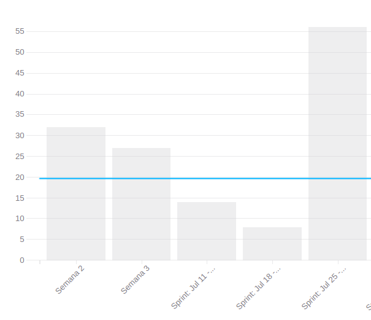

# Review Sprint 6

## 1. Visão Geral
**Número da Sprint:** 2; 
**Data de Início:** 25/07/2022; 
**Data de Término:** 01/07/2022; 
**Duração:** 7 dias; 
**Scrum Master da Sprint:** Bruno Félix; 
**Devops da Sprint:** Enzo Gabriel, Bruno Félix e Giovanna Bottino. 

## 2. Sprint Backlog

### Concluídas

1. **Issue:** [#53 Implementar o CI/CD nos Repositórios](https://github.com/fga-eps-mds/2022-1-PUMA-Doc/issues/53) 
**Responsáveis:** Bruno, Enzo, Eduardo e Cainã; 
**Pontuação:** 5; 
**Resultado:** Concluída.

2. **Issue:** [#95 Desenvolver product backlog](https://github.com/fga-eps-mds/2022-1-PUMA-Doc/issues/95) 
**Responsáveis:** Bruno, Marcelo, Samuel, Breno Henrique e Eduardo; 
**Pontuação:** 5; 
**Resultado:** Concluída.

3. **Issue:** [#10 Desenvolver product backlog](https://github.com/fga-eps-mds/2022-1-PUMA-Doc/issues/10) 
**Responsáveis:** Bruno; 
**Pontuação:** 1; 
**Resultado:** Concluída.

4. **Issue:** [#21 Treinamento de Docker](https://github.com/fga-eps-mds/2022-1-PUMA-Doc/issues/70) 
**Responsáveis:** Bruno; 
**Pontuação:** 3; 
**Resultado:** Concluída.

5. **Issue:** [#32 Desenvolver documento de arquitetura](https://github.com/fga-eps-mds/2022-1-PUMA-Doc/issues/32) 
**Responsáveis:** Ana, Breno Henrique, Breno Yuri, Caina, Eduardo, Gabriel Cabral, Felipe, Samuel e Giovanna; 
**Pontuação:** 8; 
**Resultado:** Concluída.

6. **Issue:** [#54 Implementar analytics do projeto](https://github.com/fga-eps-mds/2022-1-PUMA-Doc/issues/54) 
**Responsáveis:** Bruno, Enzo, Eduardo e Cainã; 
**Pontuação:** 2; 
**Resultado:** Concluída.

7. **Issue:** [#64 Desenvolver documento de EAP](https://github.com/fga-eps-mds/2022-1-PUMA-Doc/issues/64) 
**Responsáveis:** Bruno, Marcelo, Breno Yuri e Cainã; 
**Pontuação:** 5; 
**Resultado:** Concluída.

8. **Issue:** [#70 [Bugfix] Validar nome de Disciplina no cadastro](https://github.com/fga-eps-mds/2022-1-PUMA-Doc/issues/70) 
**Responsáveis:** Bruno, Breno Henrique e Eduardo; 
**Pontuação:** 5; 
**Resultado:** Concluída.

9. **Issue:** [#74 Resultado da Avaliação do Relatório de BugFixes e Melhorias](https://github.com/fga-eps-mds/2022-1-PUMA-Doc/issues/74) 
**Responsáveis:** Bruno, Breno Henrique e Eduardo; 
**Pontuação:** 2; 
**Resultado:** Concluída.

10. **Issue:** [#88 Treinamento de testes](https://github.com/fga-eps-mds/2022-1-PUMA-Doc/issues/88) 
**Responsáveis:** Bruno; 
**Pontuação:** 2; 
**Resultado:** Concluída.

11. **Issue:** [#83 Melhorar documento de plano de custos](https://github.com/fga-eps-mds/2022-1-PUMA-Doc/issues/93) 
**Responsáveis:** Marcelo e Ana; 
**Pontuação:** 3; 
**Resultado:** Concluída.

12. **Issue:** [#97 Desenvolver documento roadmap](https://github.com/fga-eps-mds/2022-1-PUMA-Doc/issues/97) 
**Responsáveis:** ENzo, Cabral e Breno Yuri; 
**Pontuação:** 3; 
**Resultado:** Concluída.

13. **Issue:** [#108 Replanejar Funcionalidades, Sequenciador e Canvas e Escopo do Projeto](https://github.com/fga-eps-mds/2022-1-PUMA-Doc/issues/108) 
**Responsáveis:** Bruno, Enzo e Hugo; 
**Pontuação:** 13; 
**Resultado:** Concluída.

14. **Issue:** [#61 Revisar documentação](https://github.com/fga-eps-mds/2022-1-PUMA-Doc/issues/61) 
**Responsáveis:** Hugo; 
**Pontuação:** 1; 
**Resultado:** Concluída.

15. **Issue:** [#71 [Melhoria] Sinalizar Visualmente os campos obrigatórios no cadastro](https://github.com/fga-eps-mds/2022-1-PUMA-Doc/issues/71) 
**Responsáveis:** Breno Henrique e ANa; 
**Pontuação:** 2; 
**Resultado:** Concluída.

16. **Issue:** [#76 [Melhoria] Alterar Ordenação da lista de palavras-chaves](https://github.com/fga-eps-mds/2022-1-PUMA-Doc/issues/76) 
**Responsáveis:** Cainã e Felipe; 
**Pontuação:** 3; 
**Resultado:** Concluída.

17. **Issue:** [#67 [Bugfix] Validar campos obrigatórios no cadastro](https://github.com/fga-eps-mds/2022-1-PUMA-Doc/issues/67) 
**Responsáveis:** Ana e Breno Yuri; 
**Pontuação:** 3; 
**Resultado:** Concluída.

18. **Issue:** [#82 [Bugfix] Corrigir estilo cabeçalho da tabela listagem projetos](https://github.com/fga-eps-mds/2022-1-PUMA-Doc/issues/82) 
**Responsáveis:** Eduardo e Breno Henrique; 
**Pontuação:** 5; 
**Resultado:** Concluída.

19. **Issue:** [#86 [Bugfix] Validar campos em Análise da Proposta](https://github.com/fga-eps-mds/2022-1-PUMA-Doc/issues/86) 
**Responsáveis:** Ana e Gabriel; 
**Pontuação:** 1; 
**Resultado:** Concluída.

## 3. Resultados

**Pontuação Planejada:** 75; 
**Pontuação Concluída:** 56. 

### Burndown

[Figura 1: Burndown Report gerado pelo Zenhub](../../../assets/imagens/gerenciamento/sprints/sprint2/burndown-report.png)

### Velocity

[Figura 2: Velocity Report gerado pelo Zenhub](../../../assets/imagens/gerenciamento/sprints/sprint2/velocity-report.png)

## 4. Retrospective

### Pontos Positivo

- Métricas de avaliação;
- Contato mais profundo com o código;
- Muitos pontos entregues.

### Pontos Negativos

- Dificuldade de mexer no código;
- Pouca participação da equipe como um todo nos documentos;
- Pouca conversão de trabalho em contribuição;
- Comunicação;

### Pontos a Melhorar

- Melhorar documentos;
- Ler e criticar/acrescentar aos documentos do projeto.