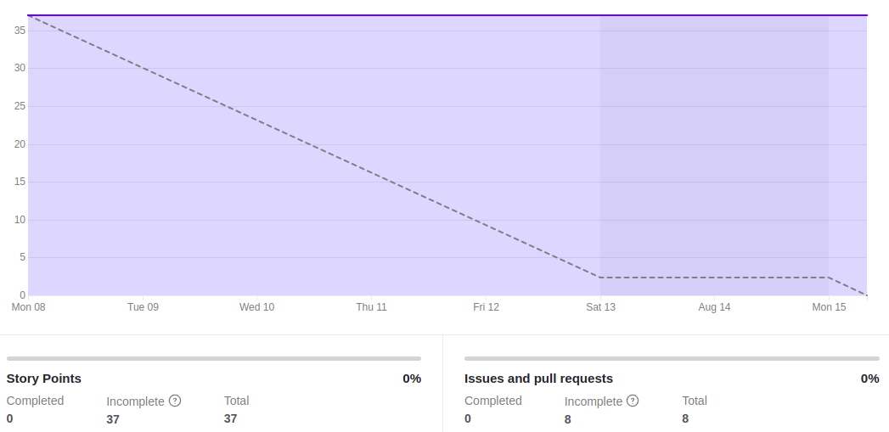
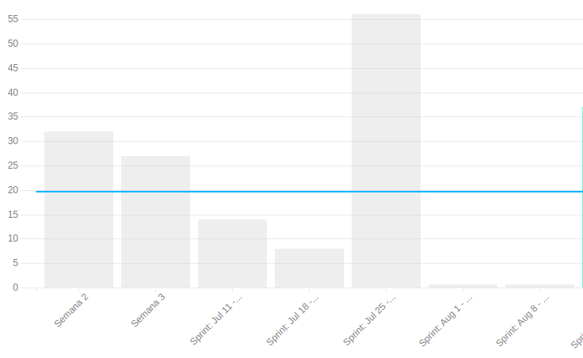

# Review Sprint 3

## 1. Visão Geral
**Número da Sprint:** 7; 
**Data de Início:** 09/08/2022; 
**Data de Término:** 16/08/2022; 
**Duração:** 7 dias; 
**Scrum Master da Sprint:** Enzo Gabriel; 
**Devops da Sprint:** Enzo Gabriel, Bruno Félix e Giovanna Bottino. 

## 2. Sprint Backlog

### Dívidas

1. **Issue:** [#98 [US] Eu, como professor, gostaria de ver as minhas disciplinas em destaque](https://github.com/fga-eps-mds/2022-1-PUMA-Doc/issues/98) 
**Responsáveis:** Ana e Cabral; 
**Pontuação:** 8; 
**Resultado:** Dívida.

2. **Issue:** [#83 [US] Eu, como usuário, gostaria de voltar para a página passada](https://github.com/fga-eps-mds/2022-1-PUMA-Doc/issues/83) 
**Responsáveis:** Breno Yuri e Cainã 
**Pontuação:** 2; 
**Resultado:** Dívida.

3. **Issue:** [#125 Atualizar planilhas usadas na documentação](https://github.com/fga-eps-mds/2022-1-PUMA-Doc/issues/125) 
**Responsáveis:** Marcelo e Cabral 
**Pontuação:** 3; 
**Resultado:** Dívida.

4. **Issue:** [#133 Adicionar README a todos os repositórios](https://github.com/fga-eps-mds/2022-1-PUMA-Doc/issues/133) 
**Responsáveis:** Enzo e Giovanna 
**Pontuação:** 3; 
**Resultado:** Dívida.

5. **Issue:** [#128 Adicionar CI aos demais repositórios](https://github.com/fga-eps-mds/2022-1-PUMA-Doc/issues/128) 
**Responsáveis:** Bruno, Enzo, Hugo e Giovanna 
**Pontuação:** 13; 
**Resultado:** Dívida.

7. **Issue:** [#130 Documentar planejamento de qualidade](https://github.com/fga-eps-mds/2022-1-PUMA-Doc/issues/130) 
**Responsáveis:** Bruno e Cainã 
**Pontuação:** 3; 
**Resultado:** Dívida.

### Concluídas

1. **Issue:** [#69 [Melhoria] Permitir visualização da senha](https://github.com/fga-eps-mds/2022-1-PUMA-Doc/issues/69) 
**Responsáveis:** Eduardo e Felipe 
**Pontuação:** 2; 
**Resultado:** Concluída.

2. **Issue:** [#106 [Bugfix] Corrigir Mensagem de erro de validação nos campos dos formulários](https://github.com/fga-eps-mds/2022-1-PUMA-Doc/issues/106) 
**Responsáveis:** Breno Henrique e Samuel 
**Pontuação:** 1; 
**Resultado:** Concluída.

3. **Issue:** [#126 Atualizar documento de arquitetura](https://github.com/fga-eps-mds/2022-1-PUMA-Doc/issues/126) 
**Responsáveis:** Giovanna e Ana 
**Pontuação:** 5; 
**Resultado:** Concluída.

4. **Issue:** [#124 Atualizar documento de visão](https://github.com/fga-eps-mds/2022-1-PUMA-Doc/issues/124) 
**Responsáveis:** Hugo e Eduardo 
**Pontuação:** 3; 
**Resultado:** Concluída.

## 3. Resultados

**Pontuação Planejada:** 37; 
**Pontuação Concluída:** 11. 

### Burndown

[Figura 1: Burndown Report gerado pelo Zenhub](../../../assets/imagens/gerenciamento/sprints/sprint3/burndown-report.png)

### Velocity

[Figura 2: Velocity Report gerado pelo Zenhub](../../../assets/imagens/gerenciamento/sprints/sprint3/velocity-report.png)

## 4. Retrospective

### Pontos Positivo

- Colaboração nas tarefas de desenvolvimento;
- Todos os integrantes com colaboração;
- Reunião com os clientes mais objetiva e proveitosa.

### Pontos Negativos

- Tarefas de desenvolvimentos ficaram como dívida técnica;
- Sprint bastante corrida;
- Muitas dívidas técnicas pós Release,

### Pontos a Melhorar

- Desenvolver mais antecipado na Sprint;
- CI;
- Conhecimento em git e github da equipe.