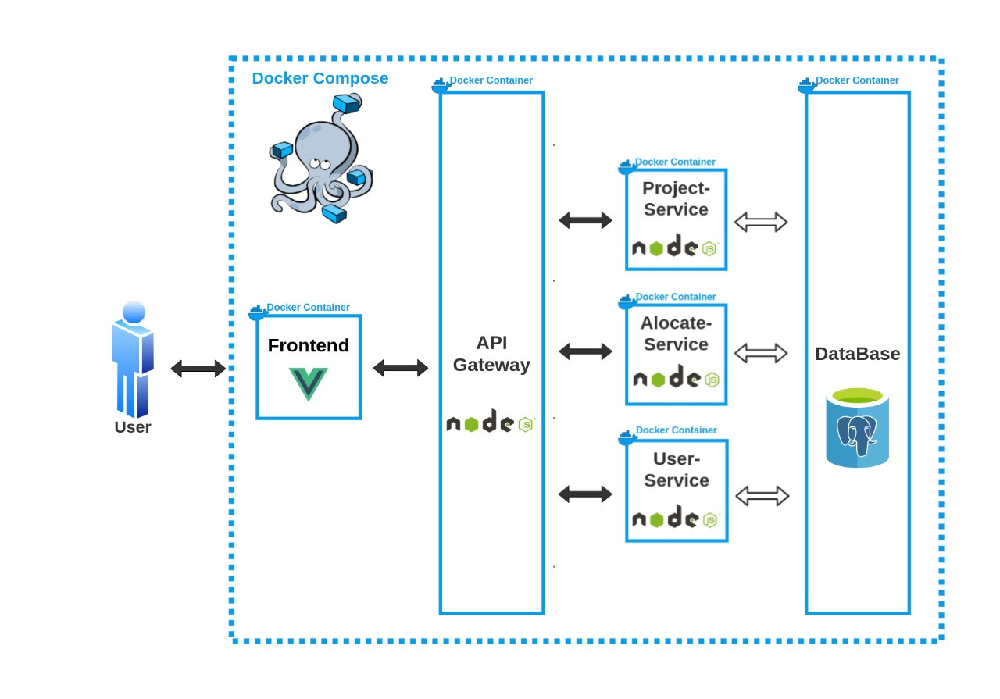
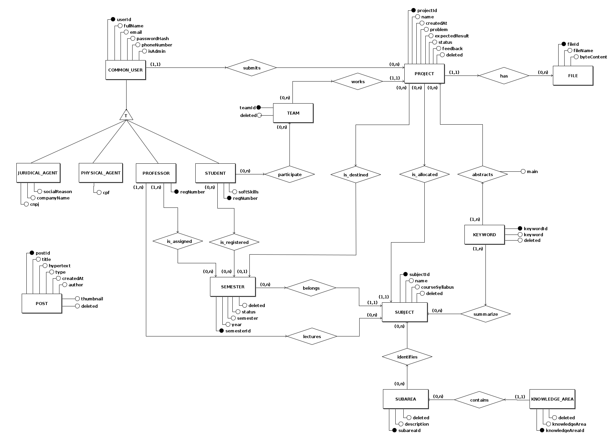
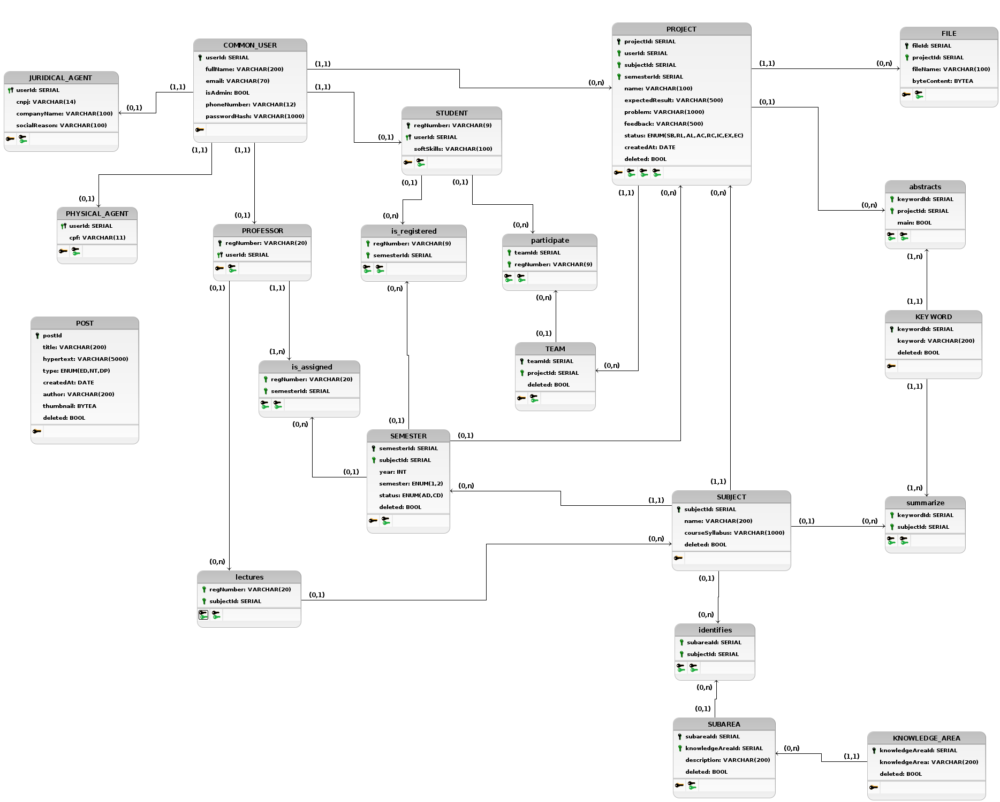

# Documento de Arquitetura
### Introdução 

 Este documento tem como finalidade especificar e documentar as decisões arquiteturais do software PUMA, usando diferentes visões arquiteturais para detalhar diferentes aspectos do sistema.

#### Escopo

    O PUMA tem como principal função dar suporte para o curso de Engenharia de Produção da Universidade de Brasília, possibilitando a seleção de grupos, cadastrar propostas de projetos, monitorar de disciplinas e receber feedbacks dos <i>stakeholders</i>.
 

 Neste documento serão expostos os padrões arquiteturais utilizados no desenvolvimento do projeto. Será apresentado neste documento a lógica de construção do sistema, tecnologias utilizadas, implementação e frameworks.

#### Visão Geral

Estrutura do documento:  

* Introdução;
* Representação da Arquitetura; 
* Metas e Restrições de Arquitetura;
* Visão lógica;

#### Definições, Acrônimos e Abreviações

| Sigla | Significado                                                                |
| :---  | :------------------------------------------------------------------------  | 
| HTML	| Hypertext Markup Language (Linguagem de Marcação de Hipertexto)            |
| HTTP  | Hypertext Transfer Protocol (Protocolo de Transferência de Hipertexto)     |
| SQL   | Structured Query Language (Linguagem de Consulta Estruturada)              |
| API   | Application Programming Interface (Interface de Programação de Aplicações) |

### Representação de relações

A imagem a seguir apresenta uma visão geral de toda a arquitetura. Representando todos os microsserviços utilizados e suas relações.

[Figura 1: Visão Geral da Arquitetura](../assets/imagens/arquitetura/diagrama-de-relacoes.png)

Essa arquitetura foi desenvolvida na primeira versão do projeto e é utilizada até hoje. Para esse semestre será modificado apenas alguns serviços apresentados na imagem a seguir.

[Figura 2: Escopo de Arquitetura do Semestre](../assets/imagens/arquitetura/diagrama-de-relacoesv2.png)

### Representação dos Serviços

#### Front End

O <i>Front End</i> é a interface onde o usuário irá se comunicar com o sistema. É composto por uma tela de cadastro e outra de registro, o que leva à página inicial do PUMA, a página de perfil de usuário. Nesse ponto, há a possibilidade de seguir diversos caminhos dentro do sistema, como as páginas de cadastro de proposta, avaliação de proposta e repositório de projetos [[2]](#ref2).

#### API Gateway

O <i>API Gateway</i> é utilizado como um mutex para a comunicação entre a interface de usuário e os outros micro-serviços. Dessa forma, ao receber uma requisição o <i>gateway</i> atua como uma ponte entre o <i>front end</i> e o serviço desejado [[2]](#ref2).

#### Project-Service

O serviço <i>Project-Service</i> foi planejado para lidar com todas as tarefas envolvendo projetos do sistema. Assim, o envio de propostas, o encaminhamento para o professor/disciplina adequada e as possíveis alterações nos projetos seriam todas tarefas para o <i>Project-Service</i> resolver [[2]](#ref2).

#### User-Service

Desenvolvido para manter o controle de usuários, desde sua criação até o controle das rotas de acesso permitidas, criação de times dentre outros [[2]](#ref2). 

### Tecnologias

#### Vue.js 

<i>Vue.js</i> é um framework JavaScript de código-aberto, focado no desenvolvimento de interfaces de usuário e aplicativos de página única [[6]](#ref6). 

#### Node.js

<i>Node.js</i> é um software de código aberto, multiplataforma, baseado no interpretador V8 do Google e que permite a execução de códigos JavaScript fora de um navegador web [[4]](#ref4). 

#### PostgreSQL 

<i>PostgreSQL</i> é um sistema gerenciador de banco de dados objeto relacional, desenvolvido como projeto de código aberto [[5]](#ref5).

#### Docker

<i>Docker</i> é um conjunto de produtos de plataforma como serviço que usam virtualização de nível de sistema operacional para entregar software em pacotes chamados contêineres. Os contêineres são isolados uns dos outros e agrupam seus próprios softwares, bibliotecas e arquivos de configuração [[3]](#ref3).

#### Docker Compose

O Compose é uma ferramenta para definir e executar aplicativos Docker de vários contêineres. Com o Compose, você usa um arquivo YAML para configurar os serviços do seu aplicativo [[1]](#ref1).

### Representação de Dados

A modelagem foi feita pela primeira equipe de desenvolvimento e continuada nesse semestre. Esse modelo foi pensado no PUMA em sua versão final, portanto, a versão atual ainda não utiliza todas as entidades presentes no mesmo. A seguir, representaremos todas as entidades, relacionamentos e tabelas para o projeto.

#### Modelo Entidade-Relacionamento

##### Entidades

&emsp;&emsp;COMMON_USER  
&emsp;&emsp;&emsp;&emsp;STUDENT  
&emsp;&emsp;&emsp;&emsp;PROFESSOR  
&emsp;&emsp;&emsp;&emsp;JURIDICAL_AGENT  
&emsp;&emsp;&emsp;&emsp;PHYSICAL_AGENT  
&emsp;&emsp;PROJECT  
&emsp;&emsp;SUBJECT  
&emsp;&emsp;CLASS  
&emsp;&emsp;FILE  
&emsp;&emsp;SUBAREA  
&emsp;&emsp;KNOWLEDGE_AREA  

##### Atributos

&emsp;&emsp;COMMON_USER (**userId**, fullName, email, passwordHash, phoneNumber, isAdmin)  
&emsp;&emsp;STUDENT (regNumber, **userId**, softSkills)  
&emsp;&emsp;PROFESSOR (regNumber, **userId**)  
&emsp;&emsp;JURIDICAL_AGENT (**userId**, cnpj, cep, companyName, socialReason)  
&emsp;&emsp;PHYSICAL_AGENT (**userId**, cpf)  
&emsp;&emsp;PROJECT (**projectId**, name, description (problem, expectedResult, knowledgeArea))  
&emsp;&emsp;SUBAREA (**subAreaId**, description)  
&emsp;&emsp;SUBJECT (**subjectId**, name, courseSyllabus)  
&emsp;&emsp;CLASS (**classId**, subjectTerm, code, regNumber, subjectId)  
&emsp;&emsp;FILE (**fileId**, projectId, filename, byteContent)  

##### Relacionamentos

&emsp;&emsp;COMMON_USER - submits - PROJECT  
&emsp;&emsp;&emsp;&emsp;Um usuário submete um ou mais projetos e um projeto é proposto por apenas um usuário.  
&emsp;&emsp;&emsp;&emsp;Cardinalidade: 1:N.  
 
&emsp;&emsp;STUDENT - participates - CLASS  
&emsp;&emsp;&emsp;&emsp;Um estudante participa de uma ou mais turmas e uma turma é participada por um ou mais alunos.  
&emsp;&emsp;&emsp;&emsp;Cardinalidade: N:M  
 
&emsp;&emsp;STUDENT - executes - PROJECT  
&emsp;&emsp;&emsp;&emsp;Um estudante executa um ou mais projetos e um projeto é executado por um ou mais alunos.  
&emsp;&emsp;&emsp;&emsp;Cardinalidade: N:M  
 
&emsp;&emsp;PROFESSOR - lectures - SUBJECT  
&emsp;&emsp;&emsp;&emsp;Um professor pode lecionar várias disciplinas e uma disciplina pode ser lecionada por vários professores.  
&emsp;&emsp;&emsp;&emsp;Cardinalidade: N:M.  
 
&emsp;&emsp;PROJECT - has - FILE  
&emsp;&emsp;&emsp;&emsp;Um projeto pode possuir vários arquivos e um arquivo pertence a somente um projeto.  
&emsp;&emsp;&emsp;&emsp;Cardinalidade: 1:N.  
 
&emsp;&emsp;SUBAREA - identifies - SUBJECT  
&emsp;&emsp;&emsp;&emsp;Uma sub-área pode identificar várias disciplinas e uma disciplina é identificada por uma ou mais sub-áreas.  
&emsp;&emsp;&emsp;&emsp;Cardinalidade: N:M.  
 
&emsp;&emsp;KNOWLEDGE_AREA - contains - SUBAREA  
&emsp;&emsp;&emsp;&emsp;Uma área do conhecimento pode conter várias subáreas e uma subárea é contida por somente uma área do conhecimento.  
&emsp;&emsp;&emsp;&emsp;Cardinalidade: N:M.  

#### Diagrama Entidade-Relacionamento

[Figura 3: Diagrama Entidade-Relacionamento](../assets/imagens/arquitetura/DER.png)

#### Diagrama Lógico de Dados

[Figura 4: Diagrama Lógico de Dados](../assets/imagens/arquitetura/DLD.png)

Esse DLD foi modelado na primeira versão do projeto e se encontra ultrapassada ao representar entidades sem relacionamentos em um Modelo Relacional de Dados. Isso deveria ser corrigido, no entanto, está fora das prioridades do cliente por não agregar nenhum valor atualmente relevante para o projeto. Nesse semestre o grupo irá trabalhar e fazer transações apenas nas tabelas existentes a seguir. 

[Figura 5: Diagrama Lógico de Dados V2](../assets/imagens/arquitetura/DLDv2.png)

#### Dicionario de Dados

##### PROJECT
| Sigla | Tipo | Descrição |
| ----- | ---- | --------- |
| SB    | ENUM | Utilizado quando a proposta é submetida.                                           |
| RL    | ENUM | Utilizado quando professor/administrador realoca a proposta para outra disciplina. |
| AL    | ENUM | Utilizado quando a proposta não possui disciplina alocada (a disciplina adequada para a proposta não é conhecida pelo professor responsável). |
| AC    | ENUM | Utilizado quando a proposta for aceita por um professor/administrador, porém ainda não incluída a nenhum semestre.|
| RC    | ENUM | Utilizado quando a proposta for recusada por um professor/administrador.           |
| IC    | ENUM | Utilizado quando a proposta for incluída para o semestre de alguma disciplina.     |
| EX    | ENUM | Utilizado quando o(s) time(s) designado(s) inicia(m) o desenvolvimento do projeto. |
| EC    | ENUM | Utilizado quando o desenvolvimento do projeto for concluído.                       |

#### SEMESTER

| Sigla | Tipo | Descrição                                |
| ----- | ---- | ---------------------------------------- |
| AD    | ENUM | Para os semestres que estão em andamento. |
| CD    | ENUM | Para os semestres concluídos.            |

#### POST

| Sigla | Tipo | Descrição                           |
| ----- | ---- | ----------------------------------- |
| ED    | ENUM | Para publicação de editais.         |
| NT    | ENUM | Para publicação de notícias.        |
| DP    | ENUM | Para divulgar os melhores projetos. |

### Referência 

[1] DOCKER. Disponível em: https://docs.docker.com/compose/. Acesso em 20 Jul 2022.

[2] DUARTE, Bruno; NOGUEIRA, Gustavo. Documento de Arquitetura do grupo PUMA 2021-2. Disponível em: https://github.com/fga-eps-mds/2021-2-PUMA-Doc. Acesso em 17 Jul 2022.

[3] WIKIPEDIA. Docker (software). Disponível em:  https://pt.wikipedia.org/wiki/Docker_(software). Acesso em 20 Jul 2022.

[4] WIKIPEDIA. Node.js. Disponível em: https://pt.wikipedia.org/wiki/Node.js. Acesso em 20 Jul 2022.

[5] WIKIPEDIA. PostgreSQL. Disponível em: https://pt.wikipedia.org/wiki/PostgreSQL. Acesso em 20 Jul 2022.

[6] WIKIPEDIA. Vue.js. Disponível em: https://pt.wikipedia.org/wiki/Vue.js. Acesso em 20 Jul 2022.

## Histórico de Revisão

| Data       | Versão | Modificação | Autor |
| :--------- | :----- | :---------- | :---- |
| 10/07/2022 | 0.1    | Criação do documento e adição da introdução | Eduardo    |
| 17/07/2022 | 0.2    | Acrescentando tópicos                       | Breno Yuri | 
| 20/07/2022 | 0.3    | Adiciona Representação de Dados             | Breno Yuri, Eduardo, Giovanna, Felipe, Cainã | 
| 23/07/2022 | 0.4    | Diagrama de relações                        | Giovanna | 
| 23/07/2022 | 1.0    | Revisão de documento                        | Hugo     |
| 31/07/2022 | 1.1    | Padronização do documento                   | Hugo     |
| 13/08/2022 | 1.2    | Atualização dos diagramas                   | Giovanna e Ana     |
| 13/08/2022 | 1.3    | Atualização de descrição do Modelo Relacional de Dados | Giovanna e Ana     |
