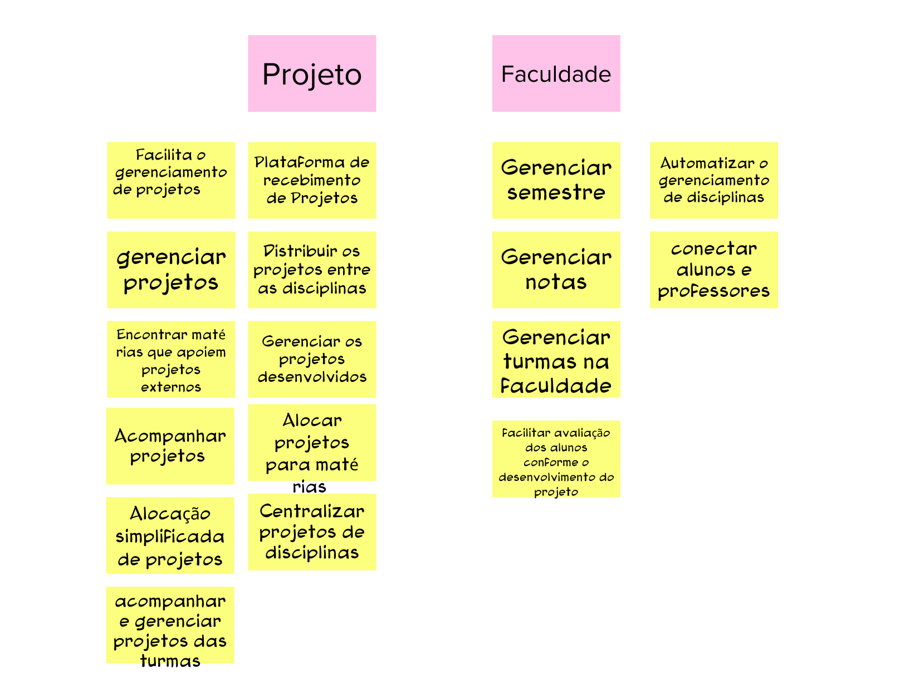
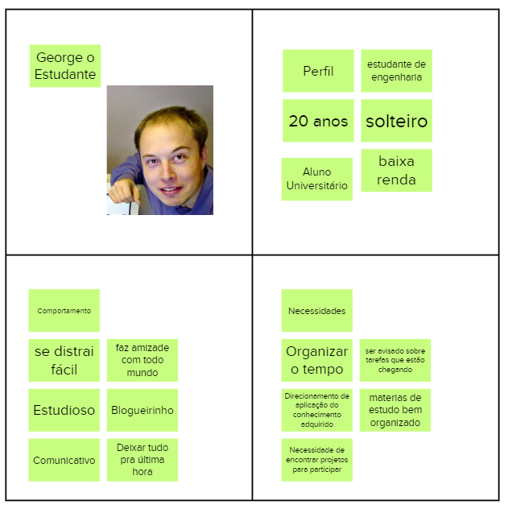
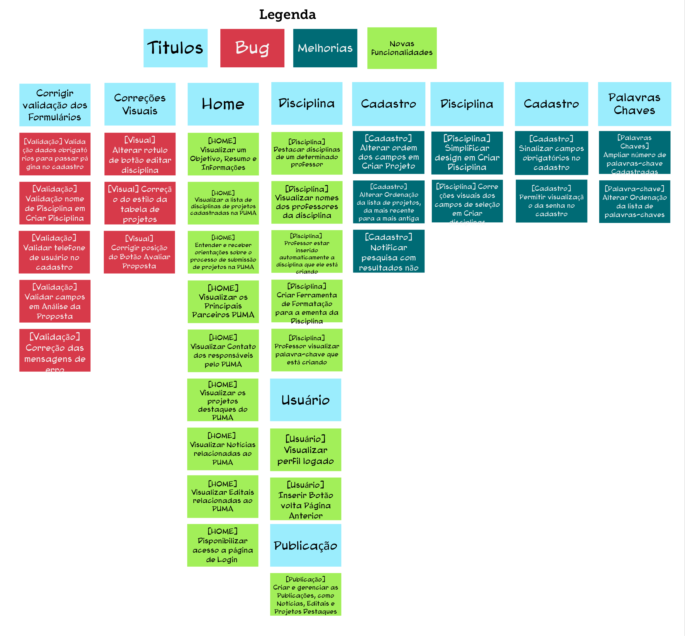
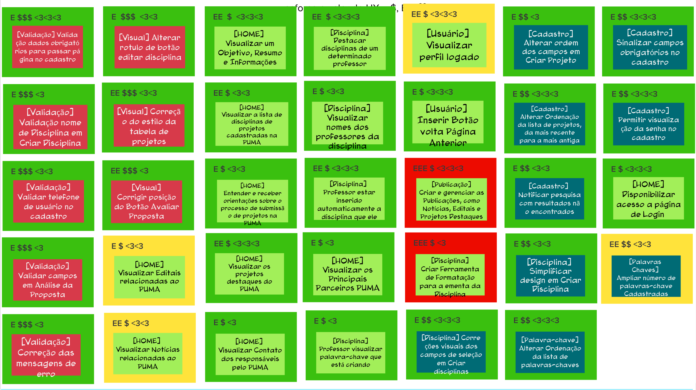
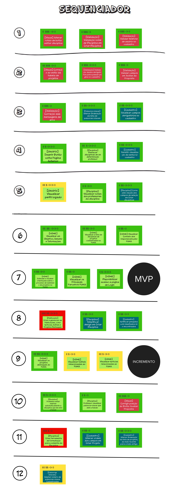
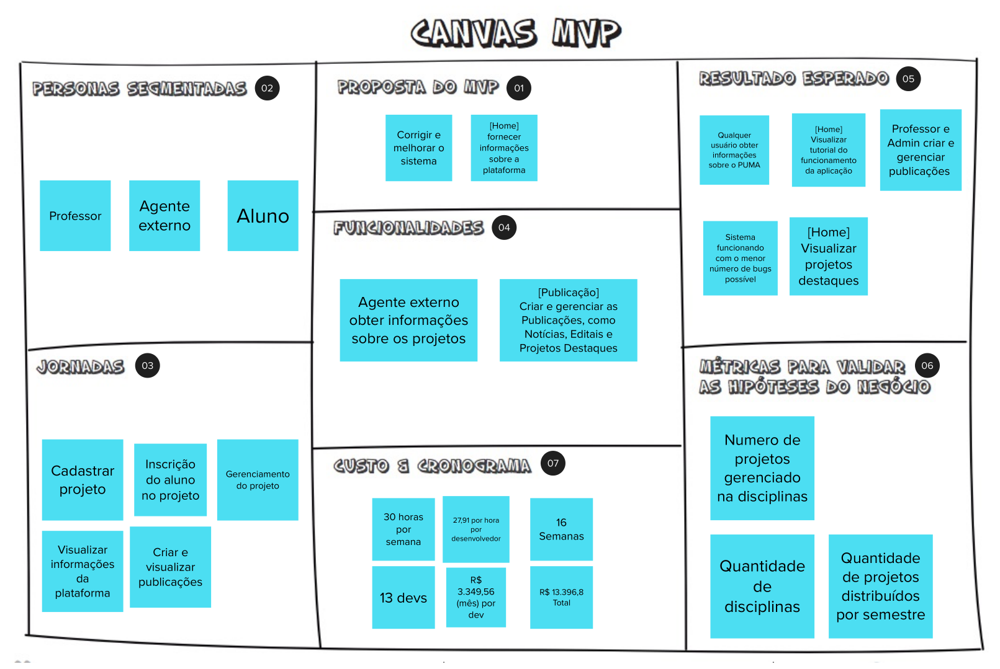

# Documento Visão
## Introdução

Este documento tem como objetivo apresentar o produto PUMA, utilizando o método Lean Inception. Esse método foi desenvolvido por Paulo Caroli, e visa construir o MVP (Produto Mínimo Viável), que é o produto com o menor risco, ou seja, menor esforço de desenvolvimento, que direciona a equipe para o desenvolvimento do produto ideal.

É desenvolvido de forma colaborativa, dividindo as etapas em <i>workshops</i>, e resultando em um aprimoramento do relacionamento entre membros de equipe e de um produto mais elaborado devido às diversas colocações durante o processo [[1]](#ref1).

### Visão do Produto

A visão do produto ajuda a trilhar o caminho inicial entre a ideia e o lançamento do MVP. Ele ajuda a definir a visão do produto de modo colaborativo e definir a essência do valor de negócio, refletindo uma mensagem clara e convincente para os clientes. [[1]](#ref1).

[Visão](../assets/imagens/lean_inception/visao.png)

### "É/ Não é" e "Faz/ Não Faz"
Muitas vezes é mais fácil descrever o que alguma coisa não é ou não faz. Esta atividade ajuda a definir o produto de forma que, por vezes é mais fácil descrever algo pelo que tal coisa não é ou deixa de fazer. Tem o objetivo de transmitir aos envolvidos uma visão mais alinhada a respeito do que o produto faz, o que o produto não faz, o que ele é e o que não é. [[1]](#ref1).

[É não é](../assets/imagens/lean_inception/e-nao-e.png)

### Objetivos do Produto

Cada participante deve compartilhar o que entende como objetivo para o negócio, e os vários pontos de vista devem ser discutidos para chegar a um consenso sobre o que é realmente importante. Esta atividade serve para auxiliar no levantamento e esclarecimento dos objetivos de acordo c/om os objetivos gerais do negócio. [[1]](#ref1).

[Objetivos do Produto](../assets/imagens/lean_inception/objetivo.png)

### Personas

A criação de personas serve para representar um usuário do sistema, descrevendo o seu papel e suas necessidades específicas. Assim, é possível identificar as funcionalidades do sistema, trazendo as necessidades da persona e auxiliando o time a descrever funcionalidades do ponto de vista de quem irá interagir com o produto final. [[1]](#ref1).

Foram criadas 3 personas para este produto, conforme imagens a seguir:

[Persona 1: Cristiano Empreendedor](../assets/imagens/lean_inception/persona1.png)

[Persona 2: Professor Jinn](../assets/imagens/lean_inception/persona2.png)

[Persona 3: Estudante George](../assets/imagens/lean_inception/persona3.png)

### Jornadas do Usuário

A jornada descreve o percurso de um usuário por uma sequência de passos para alcançar um objetivo. Alguns destes passos representam diferentes pontos de contato com o produto, caracterizando a interação da pessoa com ele.

[Jornada1: Cristiano cadastra um projeto](../assets/imagens/lean_inception/jornada1.png)

[Jornada2: Jinn gerencia projetos e turmas](../assets/imagens/lean_inception/jornada2.png)

[Jornada 3: Estudante George econtra projetos para trabalhar na disciplina](../assets/imagens/lean_inception/jornada3.png)

### Brainstorming de funcionalidades
Uma funcionalidade representa uma ação ou interação de um usuário com o produto. O brainstorming de funcionalidades,também chamada de tempestade de ideias, é uma técnica utilizada para propor soluções a um problema específico. Consiste em uma reunião na qual os participantes expõem suas sugestões e debatem sobre as contribuições do coletivo. No âmbito de software o brainstorming serve para que os participantes deem ideias de funcionalidades do produto.

[Brainstorm de Funcionalidades](../assets/imagens/lean_inception/brainstorm.png)

### Revisão Técnica, de Negócio e de UX

Esta revisão tem o objetivo de discutir como a equipe se sente em relação ao entendimento técnico, o de negócio e o de UX (Experiência de Usuário) para cada funcionalidade. A partir desta atividade, novas notas serão capturadas e as discordâncias e dúvidas ficarão mais aparentes.

[Revisão Técnica](../assets/imagens/lean_inception/revisao-tecnica.png)

### Sequenciador

O Sequenciador de funcionalidades auxilia na organização e visualização das funcionalidades e da sequência de validação incremental do produto. Para que seja seguida a ordem de priorização temos as seguintes regras:

- **Regra 1**: Uma onda pode conter no máximo três cartões.
- **Regra 2**: Uma onda não pode conter mais de uma cartão vermelho.
- **Regra 3**: Uma onda não pode conter três cartões somente amarelos ou vermelhos.
- **Regra 4**: A soma de esforço dos cartões não pode ultrapassar cinco 'E's.
- **Regra 5**: A soma de valor dos cartões não pode ser menos de quatro $s e quatro corações.
- **Regra 6**: Se um cartão depende de outro, esse outro deve estar em alguma onda anterior.

[Sequenciador](../assets/imagens/lean_inception/sequenciador.png)

### Canvas MVP

O Canvas MVP é um quadro visual que auxilia a equipe a alinhar e definir a estratégia do MVP, a versão mais simples do produto que pode ser disponibilizada para o negócio (produto mínimo) e que possa ser efetivamente utilizado e validado pelo usuário final (produto viável).

[Canvas MVP](../assets/imagens/lean_inception/mvp-canvas.png)

## Lean Inception 
Abaixo podemos observar o resuldado do Lean Inseption de modo interativo, onde temos uma 
visualização completa dos passos executados para concluir o método.

<iframe src='https://app.mural.co/embed/bafdeee6-4d4a-4ce4-a9fe-1791d3bf528a'
        width='100%'
        height='480px'
        style='min-width: 640px; min-height: 480px; background-color: #f4f4f4; border: 1px solid #efefef'
        sandbox='allow-same-origin allow-scripts allow-modals allow-popups allow-popups-to-escape-sandbox'>
</iframe>

## Referências

[1] CAROLI, Paulo. Lean Inception: Como Alinhar Pessoas e Construir o Produto Certo. Caroli. Disponível em <https://www.caroli.org/livro/lean-inception/>. Acesso em: 13 de Julho de 2022.

| Versão | Data       | Descrição | Autores |
| ------ | ---------- | --------- | ------- |
| 0.1    | 13/07/2022 | Abertura do documento | Felipe, Giovanna e Breno Henrique |
| 0.2    | 14/07/2022 | Adição de novos tópicos | Felipe |
| 0.3    | 15/07/2022 | Adição das imagens | Eduardo e Breno Yuri |
| 0.4    | 23/07/2022 | Adição do iframe | Giovanna e Hugo |
| 0.5    | 23/07/2022 | Adição de etapas com imagens lean inception | Giovanna e Hugo |
| 1.0    | 23/07/2022 | Revisão de documento | Hugo |
| 1.1    | 31/07/2022 | Atualiza Brainstorm e 'Revisão Técnica' | Hugo |
| 1.2    | 31/07/2022 | Atualiza Canvas e Sequenciador | Hugo |
| 1.3    | 11/08/2022 | Atualiza Brainstorm | Hugo  e Eduardo |
| 1.4    | 14/08/2022 | Atualiza Revisão técnica | Hugo  e Eduardo |