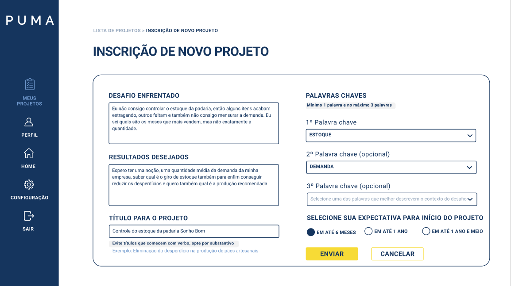

# Protótipo de Alta Fidelidade

## Histórico de Versão

| Data       | Versão | Descrição            | Autores                   |
| ---------- | ------ | -------------------- | ------------------------- |
| 16/07/2022 | 1.0    | Criação do documento | Ana Hoffmann e Breno Yuri |

## Introdução

O protótipo de alta fidelidade é criado utilizando materiais que são esperados no produto final. Por ilustrar o design finalizado, esse recurso é extremamente útil para vender ideias e discutir alterações na usabilidade do produto. Para sua criação, foi utilizada a tecnologia presente no Figma, ideal para elaboração do design de sites e aplicativos.

## Objetivo

Esse documento se propõe a apresentar o design front-end das principais páginas criadas no protótipo de alta-fidelidade. 

### Home

### Cadastro 

### Tela de login

### Inicar um projeto

### Detalhes 

### Inscrição em projeto

{ width="200" }

## Protótipo no figma

<iframe style="border: 1px solid rgba(0, 0, 0, 0.1);" width="800" height="450" src="https://www.figma.com/embed?embed_host=share&url=https%3A%2F%2Fwww.figma.com%2Ffile%2FobQQ44Z9aw1vH6oJxiGYNF%2FPUMA-22%3Fnode-id%3D0%253A1" allowfullscreen></iframe>

Caso haja problema para visualizar o iframe, o protótipo pode ser acessado [clicando aqui](https://www.figma.com/file/obQQ44Z9aw1vH6oJxiGYNF/PUMA-22?node-id=0%3A1).
