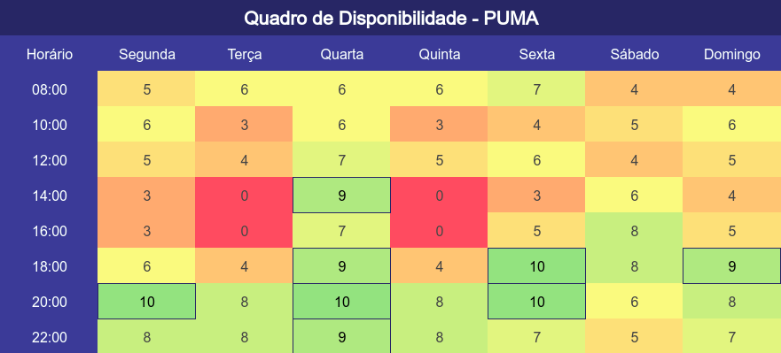
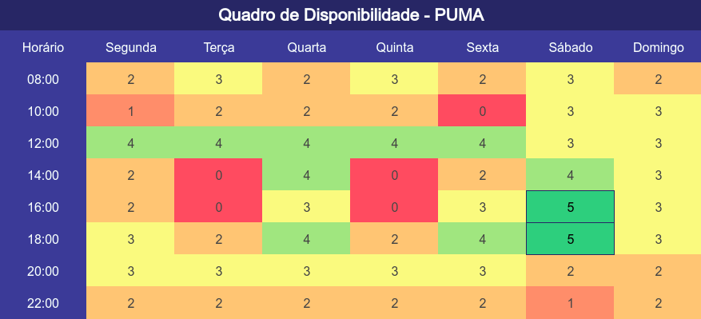
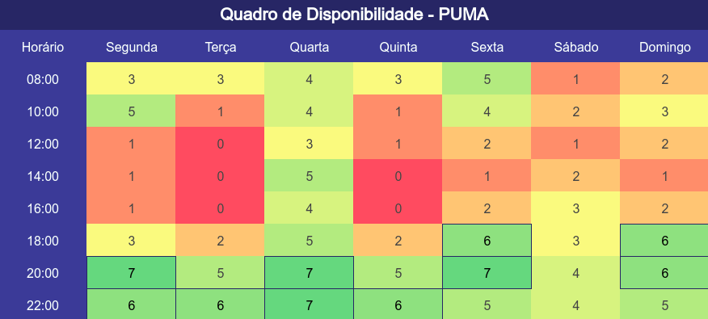

## Introdução

&emsp;&emsp;Ao longo do semestre, o grupo terá inúmeras reuniões para desenvolver o projeto. Sabendo disso, mapear os melhores horários para as reuniões é crucial.

&emsp;&emsp;Esse Quadro de Disponibilidade visa o levantamento dos melhores horários para o agendamento de reuniões, levando em consideração o maior número de pessoas livres no horário. 

## Quadro de Disponibilidade

&emsp;&emsp;Para o desenvolvimento do Quadro de Disponibilidade, o grupo pegou as informações de disponibilidade de cada integrante e compilou os dados na agenda Geral, de EPS e a de MDS. Segue os resultados do Quadro de Disponibilidade.

&emsp;&emsp;Para a visualização completa do Quadro de Disponibilidade, segue o [link do excel](https://unbbr-my.sharepoint.com/:x:/g/personal/202042927_aluno_unb_br/Eak0DMMoxBRGnc9fWgu9WB8BJ8kWUYswcyEzp21mo9bcng?e=41F88h).

### Geral
*Total: 13 Pessoas*

[Figura 01: Quadro de Disponibilidade - Geral](../assets/imagens/quadro_de_disponibilidade/quadro_disponibilidade_geral.png)

### EPS 
*Total: 5 Pessoas*

[Figura 02: Quadro de Disponibilidade - EPS](../assets/imagens/quadro_de_disponibilidade/quadro_disponibilidade_EPS.png)

### MDS
*Total: 8 Pessoas*

[Figura 03: Quadro de Disponibilidade - MDS](../assets/imagens/quadro_de_disponibilidade/quadro_disponibilidade_MDS.png)

