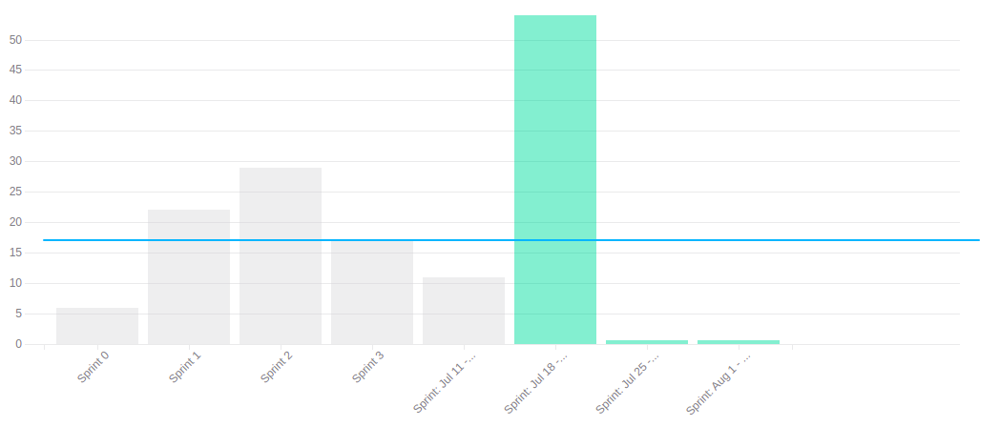

# Review Sprint 4

## 1. Visão Geral
**Número da Sprint:** 4; 
**Data de Início:** 11/07/2022; 
**Data de Término:** 17/07/2022; 
**Duração:** 7 dias; 
**Scrum Master da Sprint:** Giovanna Bottino; 
**Devops da Sprint:** Enzo Gabriel, Bruno 
**Arquiteto da Sprint:** Hugo Aragão. 

## 2. Sprint Backlog

### 2.1. Dívidas

1. **Issue:** [#21 Treinamento Docker](https://github.com/fga-eps-mds/2022-1-PUMA-Doc/issues/21) 
**Responsáveis:** Bruno; 
**Pontuação:** 3; 
**Resultado:** Dívida.

4. **Issue:** [#53 Implementar o CI/CD nos Repositórios](https://github.com/fga-eps-mds/2022-1-PUMA-Doc/issues/53) 
**Responsáveis:** Bruno, Enzo, Eduardo e Cainã; 
**Pontuação:** 5; 
**Resultado:** Dívida.

5. **Issue:** [#54 Implementar Analytics do Projeto](https://github.com/fga-eps-mds/2022-1-PUMA-Doc/issues/54) 
**Responsáveis:** Bruno, Enzo, Eduardo e Cainã; 
**Pontuação:** 2; 
**Resultado:** Dívida.

2. **Issue:** [#31 Desenvolver Documento de Visão](https://github.com/fga-eps-mds/2022-1-PUMA-Doc/issues/31) 
**Responsáveis:** MDS + Giovanna e Hugo; 
**Pontuação:** 2; 
**Resultado:** Dívida.

3. **Issue:** [#32 Desenvolver Documento de Arquitetura](https://github.com/fga-eps-mds/2022-1-PUMA-Doc/issues/32) 
**Responsáveis:** MDS + Giovanna e Hugo; 
**Pontuação:** 8; 
**Resultado:** Dívida.

### 2.2. Concluídas

6. **Issue:** [#65 Documentar Protótipo de Alta](https://github.com/fga-eps-mds/2022-1-PUMA-Doc/issues/65) 
**Responsáveis:** Breno Yuri e Ana; 
**Pontuação:** 3; 
**Resultado:** Concluída.

7. **Issue:** [Desenvolver Documento de Metodologia](https://github.com/fga-eps-mds/2022-1-PUMA-Doc/issues/60) 
**Responsáveis:** Marcelo e Cabral; 
**Pontuação:** 2; 
**Resultado:** Concluída.

8. **Issue:** [#79 Desenvolver Home/ README](https://github.com/fga-eps-mds/2022-1-PUMA-Doc/issues/79) 
**Responsáveis:** Breno Henrique; 
**Pontuação:** 2; 
**Resultado:** Concluída.

8. **Issue:** [#62 Documentação dinâmica](https://github.com/fga-eps-mds/2022-1-PUMA-Doc/issues/62) 
**Responsáveis:** Giovanna, Enzo e Marcelo; 
**Pontuação:** 1; 
**Resultado:** Concluída.

8. **Issue:** [#34 Desenvolver Plano de Contribuição](https://github.com/fga-eps-mds/2022-1-PUMA-Doc/issues/34) 
**Responsáveis:** Hugo e Breno Henrique; 
**Pontuação:** 1; 
**Resultado:** Concluída.

8. **Issue:** [#14 Planning Sprint 3](https://github.com/fga-eps-mds/2022-1-PUMA-Doc/issues/14) 
**Responsáveis:** Giovanna; 
**Pontuação:** 1; 
**Resultado:** Concluída.

8. **Issue:** [#56 Planning Sprint 4](https://github.com/fga-eps-mds/2022-1-PUMA-Doc/issues/56) 
**Responsáveis:** Giovanna; 
**Pontuação:** 1; 
**Resultado:** Concluída.

## 3. Resultados

**Pontuação Planejada:** 31; 
**Pontuação Concluída:** 11. 

## 3.1. Burndown

[Figura 1: Burndown Report gerado pelo Zenhub](../../assets/imagens/sprints/sprint5/burndown-report.png)

## 3.2. Velocity

[Figura 2: Velocity Report gerado pelo Zenhub](../../assets/imagens/sprints/sprint4/velocity-report.png)

## 4. Retrospective

### Pontos Positivos
- Começo do Projeto;
- Maior comunicação de MDS → EPS;
- Início do pareamento;
- Mais engajamento por parte dos MDS;
- Primeiro contato mais prático;
- Planejar, junto ao time do Darcy, o processo de elicitação dos bugs e melhorias.

### Pontos Negativos
- Não detalhamento das funcionalidades já entregue, bugs e melhorias;
- Não planejamento para a reunião de Quarta;
- Lean Inception travou nosso avanço;
- Algumas issues foram feitas no final da sprint;
- Não fez Daily nessa sprint;
- Nem todos os MDS participaram do projeto essa semana;

### Pontos a Melhorar
- Elicitar relatório das funcionalidades/ melhorias;
- Enviarmos via discord pauta de reunião até terça feira;
- Fechar Lean Inception após o relatório das funcionalidades/ melhorias;
- Fazer issues mais no início do sprint;
- Fazer Dailies diárias;
- Mais MDS participarem do projeto;
- Cada pessoa criar sua própria issue no início da Sprint.

## 5. Quadro de Conhecimento

[Figura 3: Quadro de Conhecimento da Sprint 4](../../assets/imagens/sprints/sprint4/quadro-conhecimento.png)
