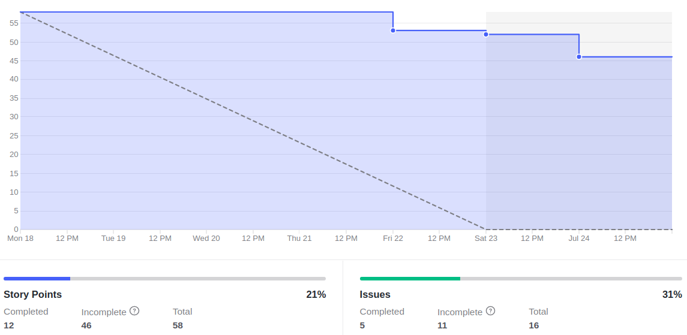
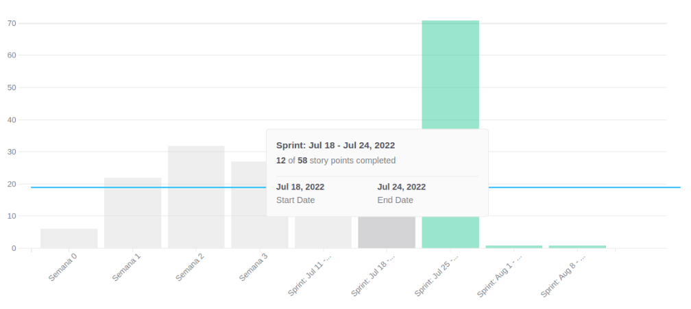

# Review Sprint 5

## 1. Visão Geral
**Número da Sprint:** 5; 
**Data de Início:** 18/07/2022; 
**Data de Término:** 24/07/2022; 
**Duração:** 7 dias; 
**Scrum Master da Sprint:** Bruno Félix; 
**Devops da Sprint:** Enzo Gabriel e Bruno Félix. 

## 2. Sprint Backlog

### Dívidas

1. **Issue:** [#21 Treinamento Docker](https://github.com/fga-eps-mds/2022-1-PUMA-Doc/issues/21) 
**Responsáveis:** Bruno; 
**Pontuação:** 3; 
**Resultado:** Concluída.

2. **Issue:** [#54 Implementar Analytics do Projeto](https://github.com/fga-eps-mds/2022-1-PUMA-Doc/issues/54) 
**Responsáveis:** Enzo, Bruno, Eduardo, Cainã; 
**Pontuação:** 2; 
**Resultado:** Dívida.

3. **Issue:** [#32 Desenvolver Documento de Arquitetura](https://github.com/fga-eps-mds/2022-1-PUMA-Doc/issues/32) 
**Responsáveis:** Giovanna, Hugo, Eduardo, Cainã, Breno Yuri e Felipe; 
**Pontuação:** 8; 
**Resultado:** Dívida.

4. **Issue:** [#64 Desenvolver Documento EAP](https://github.com/fga-eps-mds/2022-1-PUMA-Doc/issues/64) 
**Responsáveis:** Bruno, Mateus e Breno Yuri; 
**Pontuação:** 5; 
**Resultado:** Dívida.

5. **Issue:** [#70 [Bugfix] Validar nome de Disciplina no cadastro](https://github.com/fga-eps-mds/2022-1-PUMA-Doc/issues/70) 
**Responsáveis:** Bruno, Eduardo e Breno Henrique; 
**Pontuação:** 5; 
**Resultado:** Dívida.

6. **Issue:** [#74 Resultado da Avaliação do Relatório de BugFixes e Melhorias](https://github.com/fga-eps-mds/2022-1-PUMA-Doc/issues/74) 
**Responsáveis:** Giovanna, Bruno e Hugo; 
**Pontuação:** 2; 
**Resultado:** Dívida.

7. **Issue:** [#88 Treinamento de Testes](https://github.com/fga-eps-mds/2022-1-PUMA-Doc/issues/88) 
**Responsáveis:** Bruno; 
**Pontuação:** 5; 
**Resultado:** Dívida.

8. **Issue:** [#93 Melhorar Documento Plano de Custos](https://github.com/fga-eps-mds/2022-1-PUMA-Doc/issues/93) 
**Responsáveis:** Giovanna, Mateus e Ana; 
**Pontuação:** 3; 
**Resultado:** Dívida.

9. **Issue:** [#97 Desenvolvimento documento do RoadMap](https://github.com/fga-eps-mds/2022-1-PUMA-Doc/issues/97) 
**Responsáveis:** Enzo, Breno Yuri e Gabriel; 
**Pontuação:** 3; 
**Resultado:** Dívida.

10. **Issue:** [#53 Implementar o CI/CD nos Repositórios](https://github.com/fga-eps-mds/2022-1-PUMA-Doc/issues/53) 
**Responsáveis:** Bruno, Enzo, Eduardo e Cainã; 
**Pontuação:** 5; 
**Resultado:** Dívida.

11. **Issue:** [#95 Desenvolver Product Backlog](https://github.com/fga-eps-mds/2022-1-PUMA-Doc/issues/95) 
**Responsáveis:** Bruno, Mateus, Eduardo e Breno Henrique; 
**Pontuação:** 5; 
**Resultado:** Dívida.

### Concluídas

2. **Issue:** [#68 [Bugfix] Validar telefone de usuário no cadastro](https://github.com/fga-eps-mds/2022-1-PUMA-Doc/issues/68) 
**Responsáveis:** Enzo e Ana; 
**Pontuação:** 3; 
**Resultado:** Concluída.

2. **Issue:** [#75 [Bugfix] Alterar rotulo de botão editar disciplina](https://github.com/fga-eps-mds/2022-1-PUMA-Doc/issues/75) 
**Responsáveis:** Hugo e Gabriel; 
**Pontuação:** 1; 
**Resultado:** Concluída.

3. **Issue:** [#31 Desenvolver Documento de Visão](https://github.com/fga-eps-mds/2022-1-PUMA-Doc/issues/31) 
**Responsáveis:** Giovanna, Hugo, Eduardo, Breuno Henrique e Ana; 
**Pontuação:** 2; 
**Resultado:** Concluída.

4. **Issue:** [#94 Planning Sprint 5](https://github.com/fga-eps-mds/2022-1-PUMA-Doc/issues/94) 
**Responsáveis:** Bruno; 
**Pontuação:** 1; 
**Resultado:** Concluída.

5. **Issue:** [#89 Treinamento SQL](https://github.com/fga-eps-mds/2022-1-PUMA-Doc/issues/89) 
**Responsáveis:** Giovanna; 
**Pontuação:** 5; 
**Resultado:** Concluída.

## 3. Resultados

**Pontuação Planejada:** 58; 
**Pontuação Concluída:** 12. 

### Burndown

[Figura 1: Burndown Report gerado pelo Zenhub](../../assets/imagens/sprints/sprint5/burndown-report.png)

### Velocity

[Figura 2: Velocity Report gerado pelo Zenhub](../../assets/imagens/sprints/sprint5/velocity-report.png)

## 4. Retrospective

### Pontos Positivo

- Semana de início de código;
- Cada pessoa criar sua própria issue;
- Uso dos padrão de Contribuição;
- Maior comunicação para pareamentos;
- Todos participaram do projeto;
- Semana de inicio de código.

### Pontos Negativos

- Mau uso do git e das ferramentas do github;
- Dificuldade com o WSL.

### Pontos a Melhorar

- Uso maior da issue como hub de gerenciamento das tarefa.