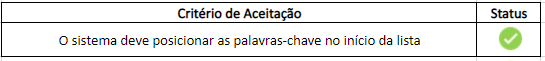

# Relatório qualidade - R1

                                                     Universidade de Brasília

                                         **Relatório de Avaliação da Qualidade –** 

                                                  **Testes Funcionais do PUMA**

                                                                  **Realease 1**

                                        **PSP5 – Projeto em Sistemas de Produção 5**

                                                       **Engenharia de Produção**

Professoras: 

Simone Borges Simão Monteiro

Ana Cristina Lima Fernandes 

Alunos:

Ana Clara Albuquerque de Miranda

Carolina Silva Rodrigues

Gabriela Viana Silva

Luiza Cardoso Queiroz

Marcos Vinícius Cruz

1. **Objetivo**

O relatório objetiva apresentar os resultados obtidos nos testes de funcionalidades da plataforma PUMA, Plataforma Unificada de Metodologias Ativas. Os testes foram realizados pela equipe de PSP5 do curso de Engenharia de Produção, que ficou responsável por avaliar, com base no teste funcional, a qualidade do sistema.

Os testes foram realizados nas seguintes especificações:

- **Sistema Operacional:** Windows 8.1
- **Resolução da tela:** 1366 x 768
- **Navegador:** Google Chrome

1. **Funcionalidades Realease 1**

O presente relatório analisa a qualidade das seguintes funcionalidades:

[#68 [Bugfix] Validar telefone de usuário no cadastro](https://github.com/fga-eps-mds/2022-1-PUMA-Doc/issues/68) 

[#70 [Bugfix] Validar nome de Disciplina no cadastro](https://github.com/fga-eps-mds/2022-1-PUMA-Doc/issues/70)

[#75 [Bugfix] Alterar rotulo de botão editar disciplina](https://github.com/fga-eps-mds/2022-1-PUMA-Doc/issues/75)

[#71 [Melhoria] Sinalizar Visualmente os campos obrigatórios no cadastro](https://github.com/fga-eps-mds/2022-1-PUMA-Doc/issues/71) 

[#76 [Melhoria] Alterar Ordenação da lista de palavras-chaves](https://github.com/fga-eps-mds/2022-1-PUMA-Doc/issues/76) 

[#67 [Bugfix] Validar campos obrigatórios no cadastro](https://github.com/fga-eps-mds/2022-1-PUMA-Doc/issues/67) 

[#82 [Bugfix] Corrigir estilo cabeçalho da tabela listagem projetos](https://github.com/fga-eps-mds/2022-1-PUMA-Doc/issues/82) 

[#86 [Bugfix] Validar campos em Análise da Proposta](https://github.com/fga-eps-mds/2022-1-PUMA-Doc/issues/86) 

1. **Testes**
    - Funcionalidade 1

**Sprint:** 5

**Issue:** [#68 [Bugfix] Validar telefone de usuário no cadastro](https://github.com/fga-eps-mds/2022-1-PUMA-Doc/issues/68)

**Critérios de Aceitação:** O sistema recusar número de telefone inválido

**Ação executada: Inseri um número inválido no campo de telefone**

**Comportamento observado:** O sistema recusou número de telefone inválido

**Evidência:**

                                     **Atendimento dos critérios de aceitação:**

- Funcionalidade 2

**Sprint:** 5

**Issue:** [#70 [Bugfix] Validar nome de Disciplina no cadastro](https://github.com/fga-eps-mds/2022-1-PUMA-Doc/issues/70)

**Critérios de Aceitação:** O sistema deve exigir nome de disciplina com ao menos 10 caracteres

**Ação executada: Inseri um nome de disciplina com menos de 10 caracteres**

**Comportamento observado:** O sistema exigiu nome de disciplina com ao menos 10 caracteres

**Evidência:**

                                      **Atendimento dos critérios de aceitação:**

- Funcionalidade 3

**Sprint:** 5

**Issue:** [#75 [Bugfix] Alterar rotulo de botão editar disciplina](https://github.com/fga-eps-mds/2022-1-PUMA-Doc/issues/75)

**Critérios de Aceitação:** O rótulo do botão de salvar disciplina deve ser “salvar”

**Ação executada: Acessei o módulo de editar disciplina**

**Comportamento observado:** O rótulo do botão de salvar disciplina é “salvar”

**Evidência:**

                                        **Atendimento dos critérios de aceitação:**

- Funcionalidade 4

**Sprint:** 6

**Issue:** [#71 [Melhoria] Sinalizar Visualmente os campos obrigatórios no cadastro](https://github.com/fga-eps-mds/2022-1-PUMA-Doc/issues/71)

**Critérios de Aceitação:** Tela com campos sinalizados

**Ação executada: Acessei o módulo de cadastro de usuário**

**Comportamento observado:** O sistema notificou o usuário dos campos obrigatórios do cadastro

**Evidência:**

                                        **Atendimento dos critérios de aceitação:**

- Funcionalidade 5

**Sprint:** 6

**Issue:** [#76 [Melhoria] Alterar Ordenação da lista de palavras-chaves](https://github.com/fga-eps-mds/2022-1-PUMA-Doc/issues/76)

**Critérios de Aceitação:** O sistema deve posicionar as palavras-chave no início da lista

**Ação executada: Inseri nova palavra-chave**

**Comportamento observado:** O sistema posicionou a nova palavra-chave no início da lista

**Evidência:**

Antes de adicionar:

Depois de adicionar:

                                        **Atendimento dos critérios de aceitação:**

- Funcionalidade 6

**Sprint:** 6

**Issue:** [#67 [Bugfix] Validar campos obrigatórios no cadastro](https://github.com/fga-eps-mds/2022-1-PUMA-Doc/issues/67)

**Critérios de Aceitação:** O sistema deve validar se os dados obrigatórios foram inseridos na primeira tela de cadastro

**Ação executada: Segui para a segunda tela de cadastro sem preencher todos os dados**

**Comportamento observado:** O sistema validou os dados obrigatórios inseridos na primeira tela de cadastro

**Evidência:**

                                        **Atendimento dos critérios de aceitação:**

- Funcionalidade 7

**Sprint:** 6

**Issue:** [#82 [Bugfix] Corrigir estilo cabeçalho da tabela listagem projetos](https://github.com/fga-eps-mds/2022-1-PUMA-Doc/issues/82)

**Critérios de Aceitação:** O layout do cabeçalho do módulo de projetos das disciplinas deve estar ajustado

**Ação executada: Acessei o módulo de projetos da disciplina**

**Comportamento observado:** O layout do cabeçalho do módulo de projetos das disciplinas está ajustado

**Evidência:**

                                        **Atendimento dos critérios de aceitação:**

- Funcionalidade 8

**Sprint:** 6

**Issue:** [#86 [Bugfix] Validar campos em Análise da Proposta](https://github.com/fga-eps-mds/2022-1-PUMA-Doc/issues/86)

**Critérios de Aceitação:** O sistema deve exigir que os campos em análise de proposta tenham ao menos 10 caracteres

**Ação executada: Acessei o módulo de projetos da disciplina**

**Comportamento observado:** O sistema exigiu que os campos em análise de proposta tenham ao menos 10 caracteres

**Evidência:**

Para proposta aceita:

Para proposta rejeitada:

                                        **Atendimento dos critérios de aceitação:**

**Avaliação da qualidade – R1**

Com base nos testes funcionais conclui-se que a qualidade das entregas da release 1 foi de 100%, ou seja, classificada como excelente.

