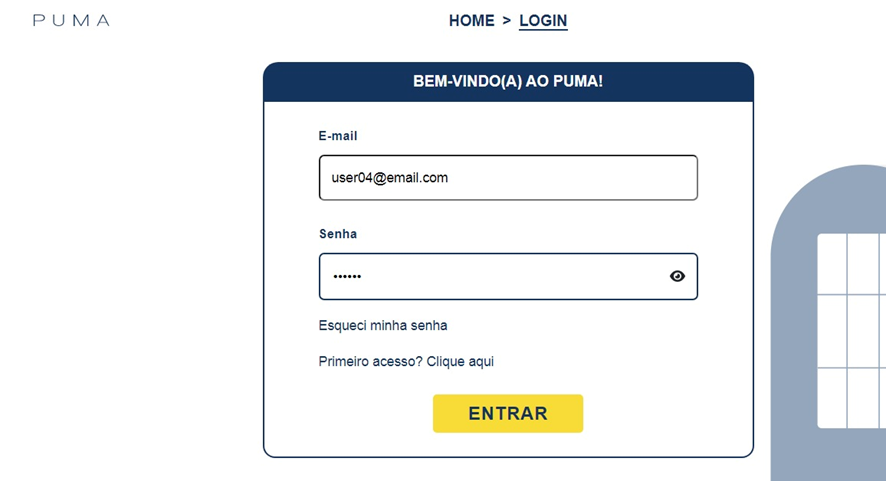
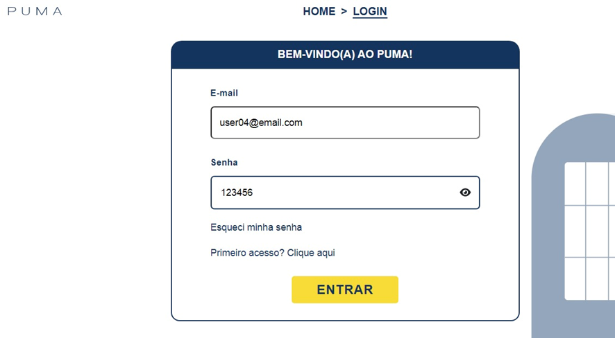
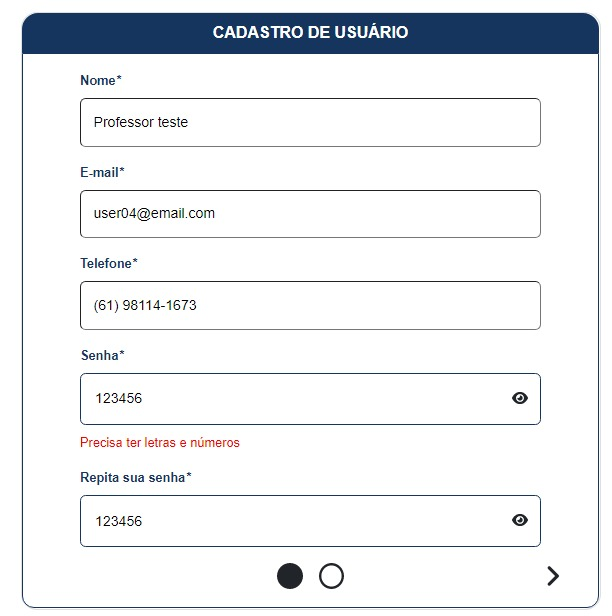
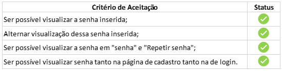
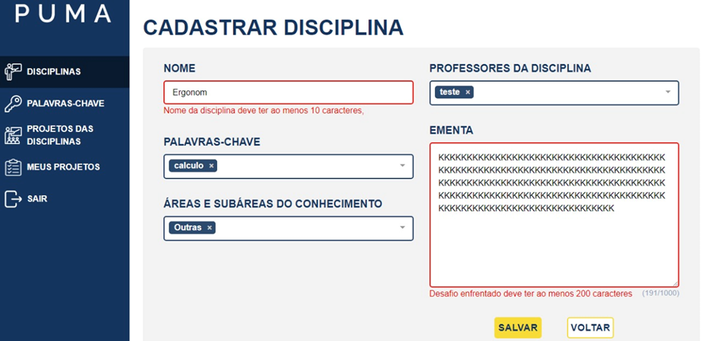
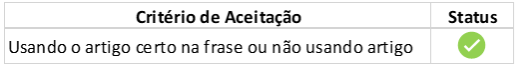
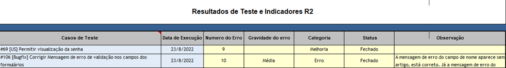
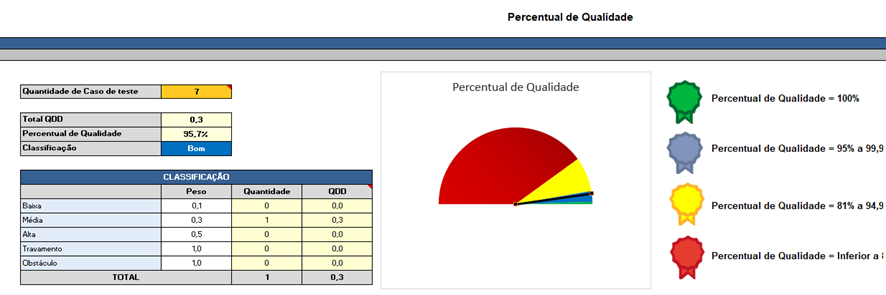

# Relatório qualidade - R2

                                                     Universidade de Brasília

                                           **Relatório de Avaliação da Qualidade –** 

                                                  **Testes Funcionais do PUMA**

                                                                **Realease 2**

                                        **PSP5 – Projeto em Sistemas de Produção 5**

                                                       **Engenharia de Produção**

Professoras: 

Simone Borges Simão Monteiro

Ana Cristina Lima Fernandes 

Alunos:

Ana Clara Albuquerque de Miranda

Carolina Silva Rodrigues

Gabriela Viana Silva

Luiza Cardoso Queiroz

Marcos Vinícius Cruz

1. **Objetivo**

O relatório objetiva apresentar os resultados obtidos nos testes de funcionalidades da plataforma PUMA, Plataforma Unificada de Metodologias Ativas. Os testes foram realizados pela equipe de PSP5 do curso de Engenharia de Produção, que ficou responsável por avaliar, com base no teste funcional, a qualidade do sistema.

Os testes foram realizados nas seguintes especificações:

- **Sistema Operacional:** Windows 8.1
- **Resolução da tela:** 1366 x 768
- **Navegador:** Google Chrome

1. **Funcionalidades Realease 2**

O presente relatório analisa a qualidade das seguintes funcionalidades:

[#69 [US] Permitir visualização da senha](https://github.com/fga-eps-mds/2022-1-PUMA-Doc/issues/69)

 ****[#106 [Bugfix] Corrigir Mensagem de erro de validação nos campos dos formulários](https://github.com/fga-eps-mds/2022-1-PUMA-Doc/issues/106)

1. **Testes**
    - Funcionalidade 1

**Sprint:** 5

**Issue:** [#69 [US] Permitir visualização da senha](https://github.com/fga-eps-mds/2022-1-PUMA-Doc/issues/69)

**Critérios de Aceitação:** 

- Ser possível visualizar a senha inserida;
- Alternar visualização dessa senha inserida;
- Ser possível visualizar a senha em "senha" e "Repetir senha";
- Ser possível visualizar senha tanto na página de cadastro tanto na de login.

**Ação executada:** Inseri uma senha

**Comportamento observado:** O usuário consegue visualizar a senha escrita

**Evidência:**

                                **Atendimento dos critérios de aceitação:**

- Funcionalidade 2

**Sprint:** 5

**Issue:** [#106 [Bugfix] Corrigir Mensagem de erro de validação nos campos dos formulários](https://github.com/fga-eps-mds/2022-1-PUMA-Doc/issues/106)

**Critério de Aceitação:** Usando o artigo certo na frase ou não usando artigo.

**Ação executada:** Fiz login como professor, tentei criar uma disciplina, coloquei menos que o mínimo de caracteres no campo nome e/ou ementa.

**Comportamento observado:** A mensagem de erro do campo de nome aparece sem artigo, está correto. Já a mensagem de erro do campo de ementa não conduz com o campo. Deveria aparecer “A descrição da ementa deve ter ao menos 200 caracteres”.

**Evidência:**

                                     **Atendimento dos critérios de aceitação:**

**Avaliação da qualidade – R2**

Com base nos testes funcionais conclui-se que a qualidade das entregas da release 2 foi de 95,7%, ou seja, classificada como bom.

