# Relatório qualidade - R3

                                                     Universidade de Brasília

                                           **Relatório de Avaliação da Qualidade –** 

                                                  **Testes Funcionais do PUMA**

                                                                 **Realease 3**

                                        **PSP5 – Projeto em Sistemas de Produção 5**

                                                       **Engenharia de Produção**

Professoras: 

Simone Borges Simão Monteiro

Ana Cristina Lima Fernandes 

Alunos:

Ana Clara Albuquerque de Miranda

Carolina Silva Rodrigues

Gabriela Viana Silva

Luiza Cardoso Queiroz

Marcos Vinícius Cruz

1. **Objetivo**

O relatório objetiva apresentar os resultados obtidos nos testes de funcionalidades da plataforma PUMA, Plataforma Unificada de Metodologias Ativas. Os testes foram realizados pela equipe de PSP5 do curso de Engenharia de Produção, que ficou responsável por avaliar, com base no teste funcional, a qualidade do sistema.

Os testes foram realizados nas seguintes especificações:

- **Sistema Operacional:** Windows 8.1
- **Resolução da tela:** 1366 x 768
- **Navegador:** Google Chrome

1. **Funcionalidades Realease 3**

O presente relatório analisa a qualidade das seguintes funcionalidades:

[#83 [US] Eu, como usuário, gostaria de voltar para a página passada](https://github.com/fga-eps-mds/2022-1-PUMA-Doc/issues/83) 

[#98 [US] Eu, como professor, gostaria de ver as minhas disciplinas em destaque](https://www.notion.so/Relat-rio-qualidade-R1-95e43cc895c341e29a91fe5fb817e833) 

[#101 [Melhoria] Correções visuais dos campos de seleção em Criar disciplinas](https://www.notion.so/Relat-rio-qualidade-R1-95e43cc895c341e29a91fe5fb817e833) 

[#109 [US] Eu, como professor, gostaria de ver somente informações importantes na listagem de disciplinas, além de uma coluna com os nomes dos professores responsáveis por cada disciplina](https://www.notion.so/Relat-rio-qualidade-R1-95e43cc895c341e29a91fe5fb817e833) 

1. **Testes**
    - Funcionalidade 1

**Sprint:** 4

**Issue:** [#83 [US] Eu, como usuário, gostaria de voltar para a página passada](https://github.com/fga-eps-mds/2022-1-PUMA-Doc/issues/83)

**Critérios de Aceitação:**

- Usuário conseguir voltar a tela originária da ação atual, para todas as páginas que necessitam disso.
- O botão possuir um efeito de hover. Ao passar o cursor em cima, apresentar uma interação conforme a prototipação.

**Ação executada: Voltar para a página passada**

**Comportamento observado:** O usuário consegue voltar à página anterior, quando possível

**Evidência:**

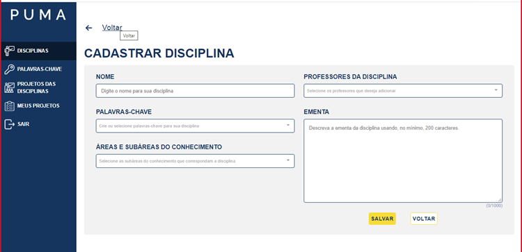

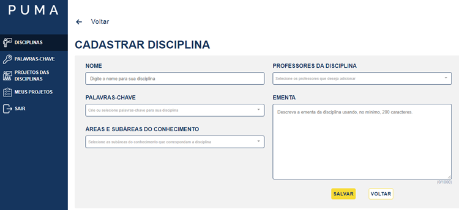

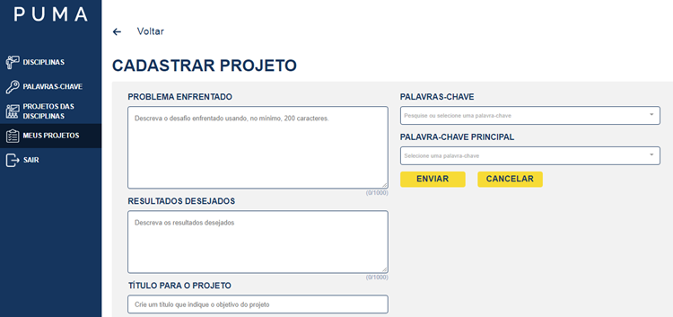

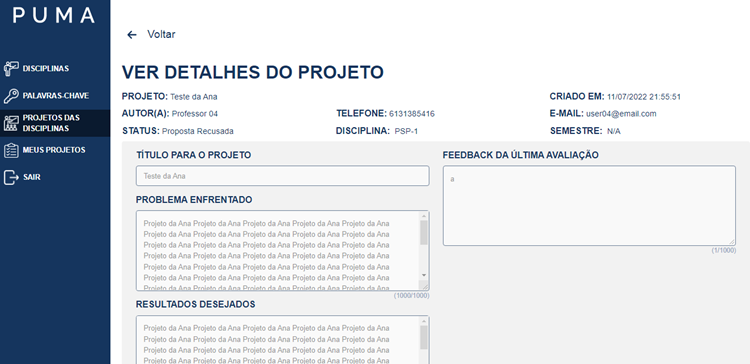

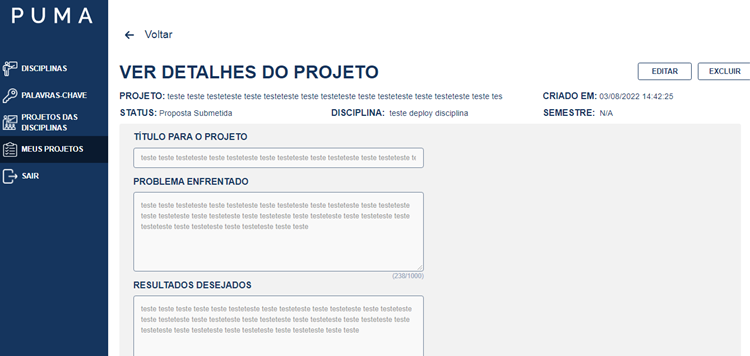

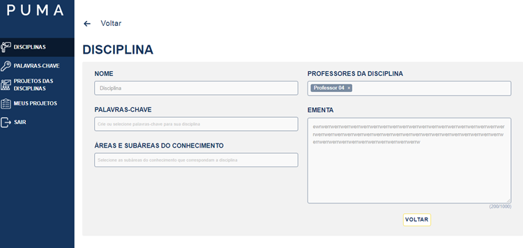

**Atendimento dos critérios de aceitação:**

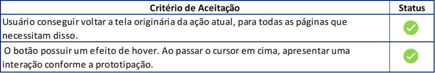

- Funcionalidade 2

**Sprint:** 4

**Issue:** #98 [US] Eu, como professor, gostaria de ver as minhas disciplinas em destaque

**Critério de Aceitação:** As disciplinas do professor estarem devidamente destacadas das outras disciplinas.

**Ação executada: O usuário tentou cadastrar uma nova disciplina e o sistema apresentou erro.**

**Comportamento observado: erro ao cadastrar a disciplina. Porém, as disciplinas estão em destaque para o usuário.**

**Evidência:**

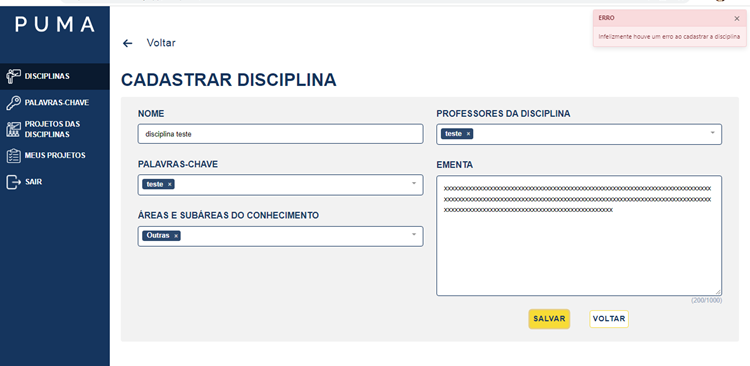

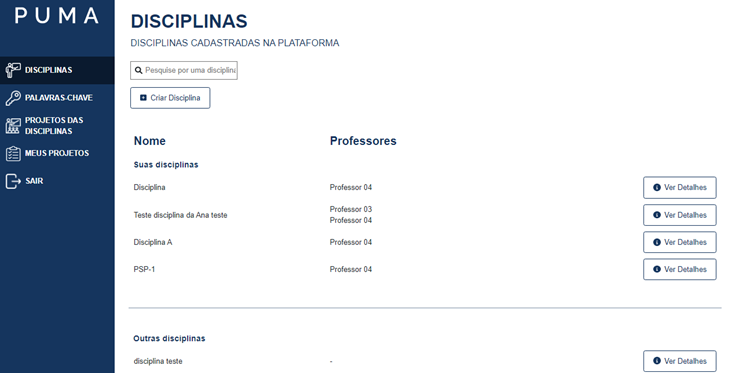

**Atendimento dos critérios de aceitação:**

- Funcionalidade 3

**Sprint:** 5

**Issue:** #101 [Melhoria] Correções visuais dos campos de seleção em Criar disciplinas

**Critério de Aceitação:**

- A cor azul notificar visualmente a ação de selecionar/ remover uma Área ou subárea;
- A cor azul notificar visualmente a ação de selecionar/ remover uma Palavras Chaves.

**Ação executada: O usuário selecionou/removeu palavras-chaves e áreas e subáreas do conhecimento**

**Comportamento observado: A cor azul notifica onde o usuário está selecionando/removendo.**

**Evidência:**

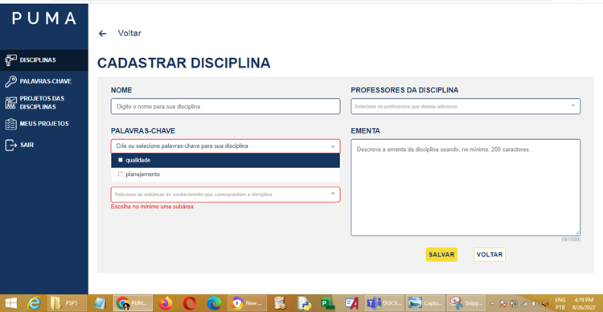

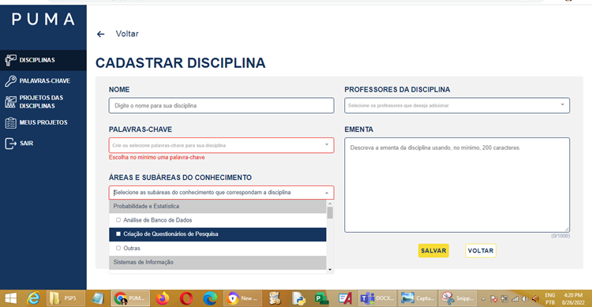

**Atendimento dos critérios de aceitação:**

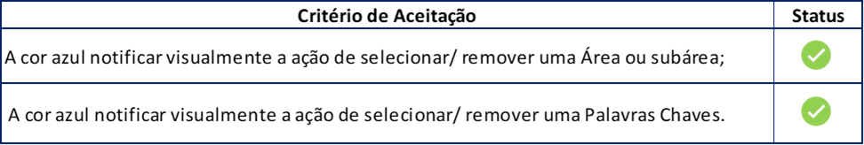

- Funcionalidade 4

**Sprint:** 4

**Issue:** #109 [US] Eu, como professor, gostaria de ver somente informações importantes na listagem de disciplinas, além de uma coluna com os nomes dos professores responsáveis por cada disciplina

**Critério de Aceitação:**

- A Lista de Disciplinas ter a coluna "Professores", com a lista dos professores responsáveis por aquela disciplina;
- A coluna ID ser devidamente retirada;
- Os Botões Editar e Excluir serem devidamente retirados;

**Ação executada: O usuário entrou na tela de disciplinas.**

**Comportamento observado: Houve a remoção dos botões Editar e Excluir, e da coluna ID. É possível verificar o nome dos professores responsável pela disciplina ao lado do nome.**

**Evidência:**

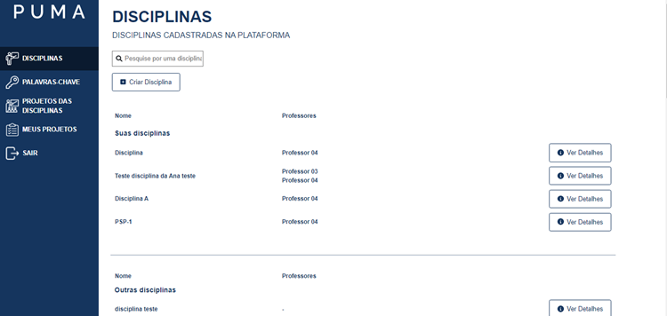

**Atendimento dos critérios de aceitação:**

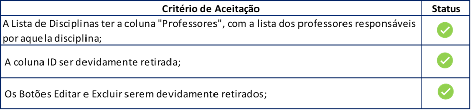

**Avaliação da qualidade – R3**

Com base nos testes funcionais conclui-se que a qualidade das entregas da release 3 foi de 97,5%, ou seja, classificada como bom.

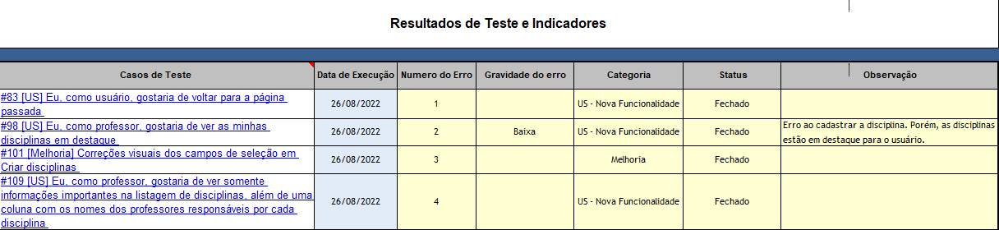

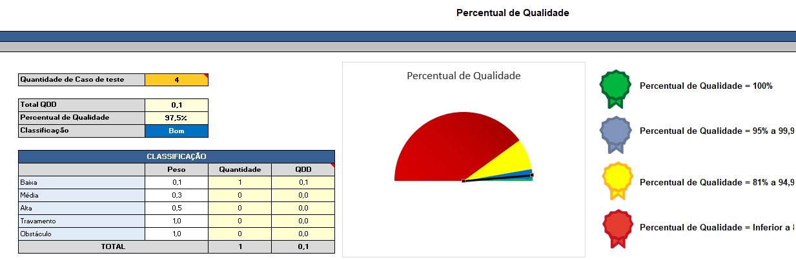