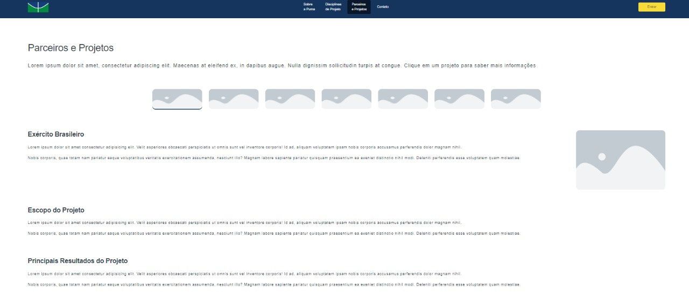
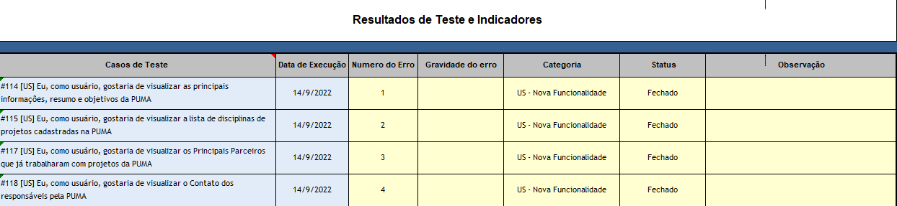

# Relatório qualidade - R4

                                                     Universidade de Brasília

                                           **Relatório de Avaliação da Qualidade –** 

                                                  **Testes Funcionais do PUMA**

                                                                 **Realease 4**

                                        **PSP5 – Projeto em Sistemas de Produção 5**

                                                       **Engenharia de Produção**

Professoras: 

Simone Borges Simão Monteiro

Ana Cristina Lima Fernandes 

Alunos:

Ana Clara Albuquerque de Miranda

Carolina Silva Rodrigues

Gabriela Viana Silva

Luiza Cardoso Queiroz

Marcos Vinícius Cruz

1. **Objetivo**

O relatório objetiva apresentar os resultados obtidos nos testes de funcionalidades da plataforma PUMA, Plataforma Unificada de Metodologias Ativas. Os testes foram realizados pela equipe de PSP5 do curso de Engenharia de Produção, que ficou responsável por avaliar, com base no teste funcional, a qualidade do sistema.

Os testes foram realizados nas seguintes especificações:

- **Sistema Operacional:** Windows 8.1
- **Resolução da tela:** 1366 x 768
- **Navegador:** Google Chrome

1. **Funcionalidades Realease 3**

O presente relatório analisa a qualidade das seguintes funcionalidades:

**[#114 [US] Eu, como usuário, gostaria de visualizar as principais informações, resumo e objetivos da PUMA](https://github.com/fga-eps-mds/2022-1-PUMA-Doc/issues/114)** 

**[#115 [US] Eu, como usuário, gostaria de visualizar a lista de disciplinas de projetos cadastradas na PUMA](https://github.com/fga-eps-mds/2022-1-PUMA-Doc/issues/115)** 

**[#117 [US] Eu, como usuário, gostaria de visualizar os Principais Parceiros que já trabalharam com projetos da PUMA](https://github.com/fga-eps-mds/2022-1-PUMA-Doc/issues/117)

**[#118 [US] Eu, como usuário, gostaria de visualizar o Contato dos responsáveis pela PUMA](https://github.com/fga-eps-mds/2022-1-PUMA-Doc/issues/118)** 

1. **Testes**
    - Funcionalidade 1

**Sprint: 5**

**Issue: [#114 [US] Eu, como usuário, gostaria de visualizar as principais informações, resumo e objetivos da PUMA](https://github.com/fga-eps-mds/2022-1-PUMA-Doc/issues/114)** 

**Critérios de Aceitação:**

- Ser possível ler Principais Informações da PUMA;
- Ser possível ler o Resumo da PUMA;
- Ser possível ler os Principais Objetivos da PUMA;
- Todo e qualquer usuário conseguir visualizar principais informações, resumo e objetivos da PUMA.

**Ação executada:** 

O usuário acessou a aba “Sobre a Puma”

**Comportamento observado:** 

Foi possível ler as principais informações, o resumo e os principais objetivos da PUMA

**Evidência:**

**Atendimento dos critérios de aceitação:**

- Funcionalidade 2

**Sprint: 5**

**Issue: [#115 [US] Eu, como usuário, gostaria de visualizar a lista de disciplinas de projetos cadastradas na PUMA](https://github.com/fga-eps-mds/2022-1-PUMA-Doc/issues/115)** 

**Critério de Aceitação:** 

- Todas as disciplinas de projetos da PUMA estarem listadas;
- Cada disciplina deve ter uma descrição sobre o que ela é, seus objetivos e como ela trabalha os projetos dentro dela;
- Cada disciplina deve disponibiliza sua ementa;
- Todo e qualquer usuário conseguir visualizar a lista de disciplinas de projetos cadastradas na PUMA.

**Ação executada:**

O usuário acessou a aba “Disciplinas de projeto”

**Comportamento observado:** 

Todas as disciplinas estavam listadas, com descrição, objetivo e ementa

**Evidência:**

**Atendimento dos critérios de aceitação:**

- Funcionalidade 3

**Sprint: 5**

**Issue:** [#117 [US] Eu, como usuário, gostaria de visualizar os Principais Parceiros que já trabalharam com projetos da PUMA](https://github.com/fga-eps-mds/2022-1-PUMA-Doc/issues/117)

**Critério de Aceitação:** 

- Todos os Principais Parceiros que já trabalharam com projetos da PUMA estarem listados na plataforma;
- Cada Principal Parceiro ter uma descrição do trabalho dele dentro da PUMA;
- Cada Principal Parceiro ter os resultados de seus projetos desenvolvidos na PUMA;
- Todo e qualquer usuário conseguir visualizar os Principais Parceiros que já trabalharam com projetos da PUMA.

**Ação executada:**

O usuário acessou a aba “Parceiros de Projeto”

**Comportamento observado:** 

Todos os parceiros estavam listados, com descrição e resultados

**Evidência:**

**Atendimento dos critérios de aceitação:**

- Funcionalidade 4

**Sprint: 5**

**Issue: [#118 [US] Eu, como usuário, gostaria de visualizar o Contato dos responsáveis pela PUMA](https://github.com/fga-eps-mds/2022-1-PUMA-Doc/issues/118)** 

**Critério de Aceitação:** 

- Todos os Contato dos Responsáveis pela PUMA estarem listados na plataforma;
- Cada responsável pela PUMA ter seu email institucional informado;
- Todo e qualquer usuário conseguir ter acesso ao Contato dos responsáveis pelo PUMA.

**Ação executada:**

O usuário acessou a aba “Contato”

**Comportamento observado:** 

Todos os contatos dos responsáveis pela PUMA estavam listados, cada um com e-mail institucional

**Evidência:**

**Atendimento dos critérios de aceitação:**

**Avaliação da qualidade – R4**

Com os testes realizados, foi possível partir para uma análise quantitativa da qualidade, a partir de parâmetros definidos por peso em relação à gravidade do erro da plataforma em paralelo com o impacto que este causaria na performance da qualidade do *software.* 

Um exemplo encontra-se na Tabela 1:

                                                  Tabela 1: Quantitativos de Qualidade.

Para obtenção do resultado final realiza-se uma média ponderada a partir da QDD, obtendo um KPI (*Key Performance Indicator*) de qualidade representado em percentual. Com base nesse valor de qualidade, é possível classificar a qualidade do produto conforme ilustra a Figura 2.

                                          Figura 2: Classificação por Percentual de Qualidade.

Com base nos testes funcionais conclui-se que a qualidade das entregas da release 4 foi de 100%, ou seja, classificada como Excelente.

