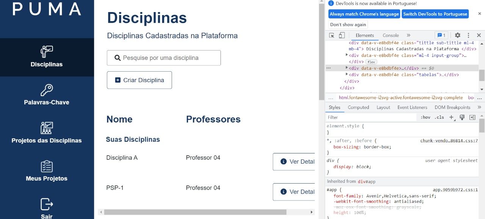
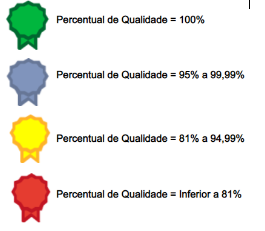

# Relatório qualidade - R5

                                                     Universidade de Brasília

                                           **Relatório de Avaliação da Qualidade –** 

                                                  **Testes Funcionais do PUMA**

                                                                 **Realease 5**

                                        **PSP5 – Projeto em Sistemas de Produção 5**

                                                       **Engenharia de Produção**

Professoras: 

Simone Borges Simão Monteiro

Ana Cristina Lima Fernandes 

Alunos:

Ana Clara Albuquerque de Miranda

Carolina Silva Rodrigues

Gabriela Viana Silva

Luiza Cardoso Queiroz

Marcos Vinícius Cruz

1. **Objetivo**

O relatório objetiva apresentar os resultados obtidos nos testes de funcionalidades da plataforma PUMA, Plataforma Unificada de Metodologias Ativas. Os testes foram realizados pela equipe de PSP5 do curso de Engenharia de Produção, que ficou responsável por avaliar, com base no teste funcional, a qualidade do sistema.

Os testes foram realizados nas seguintes especificações:

- **Sistema Operacional:** Windows 8.1
- **Resolução da tela:** 1366 x 768
- **Navegador:** Google Chrome

1. **Funcionalidades Realease 5**

O presente relatório analisa a qualidade das seguintes funcionalidades:

**[#85 [Melhoria] Corrigir posição do Botão Avaliar Proposta](https://github.com/fga-eps-mds/2022-1-PUMA-Doc/issues/85)**

**[#123 [US] Eu, como usuário, gostaria de ter acesso a página de login enquanto estiver navegando pela Home da PUMA](https://github.com/fga-eps-mds/2022-1-PUMA-Doc/issues/123)**

**[#146 [Melhoria] Refatoração e Responsividade - Listagem Disciplina](https://github.com/fga-eps-mds/2022-1-PUMA-Doc/issues/146)**

1. **Testes**
    - Funcionalidade 1

**Sprint: 6**

**Issue:** [#85 [Melhoria] Corrigir posição do Botão Avaliar Proposta](https://github.com/fga-eps-mds/2022-1-PUMA-Doc/issues/85)

**Critérios de Aceitação:**

- O botão aparecer na tela.

**Ação executada:** 

O usuário entrou na tela de Projetos das Disciplinas e após isso foi em análise de um projeto.

**Comportamento observado:** 

O botão “avaliar” está na posição correta.

**Evidência:**

**Atendimento dos critérios de aceitação:**

- Funcionalidade 2

**Sprint: 6**

**Issue:** #123 **[[US] Eu, como usuário, gostaria de ter acesso a página de login enquanto estiver navegando pela Home da PUMA](https://github.com/fga-eps-mds/2022-1-PUMA-Doc/issues/123)**

**Critério de Aceitação:** 

- Ter na home um botão que leva para a página de Login.
- Esse botão estar localizado em um lugar de fácil visibilidade.

**Ação executada:**

O usuário entrou na página Home.

**Comportamento observado:** 

Há um botão na página Home que leva ao Login, em local de fácil acesso.

**Evidência:**

**Atendimento dos critérios de aceitação:**

- Funcionalidade 3

**Sprint: 6**

**Issue:** #146 **[[Melhoria] Refatoração e Responsividade - Listagem Disciplina](https://github.com/fga-eps-mds/2022-1-PUMA-Doc/issues/146)**

**Critério de Aceitação:** 

- Tela responsível.

**Ação executada:**

O usuário solicitou o inspecionamento da página de “Disciplinas” e após isso solicitou o modo responsivo.

**Comportamento observado:** 

Página refatorada e responsiva.

**Evidência:**

**Atendimento dos critérios de aceitação:**

**Avaliação da qualidade – R5**

Com os testes realizados, foi possível partir para uma análise quantitativa da qualidade, a partir de parâmetros definidos por peso em relação à gravidade do erro da plataforma em paralelo com o impacto que este causaria na performance da qualidade do *software.* 

Um exemplo encontra-se na Tabela 1:

                                                  Tabela 1: Quantitativos de Qualidade.

Para obtenção do resultado final realiza-se uma média ponderada a partir da QDD, obtendo um KPI (*Key Performance Indicator*) de qualidade representado em percentual. Com base nesse valor de qualidade, é possível classificar a qualidade do produto conforme ilustra a Figura 2.

                                          Figura 2: Classificação por Percentual de Qualidade.

Com base nos testes funcionais conclui-se que a qualidade das entregas da release 5 foi de 100%, ou seja, classificada como Excelente.

