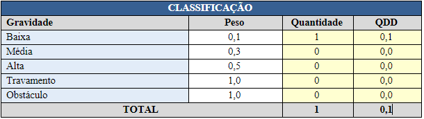

# Relatório qualidade - R6

                                                     Universidade de Brasília

                                           **Relatório de Avaliação da Qualidade –** 

                                                  **Testes Funcionais do PUMA**

                                                                 **Realease 6**

                                        **PSP5 – Projeto em Sistemas de Produção 5**

                                                       **Engenharia de Produção**

Professoras: 

Simone Borges Simão Monteiro

Ana Cristina Lima Fernandes 

Alunos:

Ana Clara Albuquerque de Miranda

Carolina Silva Rodrigues

Gabriela Viana Silva

Luiza Cardoso Queiroz

Marcos Vinícius Cruz

1. **Objetivo**

O relatório objetiva apresentar os resultados obtidos nos testes de funcionalidades da plataforma PUMA, Plataforma Unificada de Metodologias Ativas. Os testes foram realizados pela equipe de PSP5 do curso de Engenharia de Produção, que ficou responsável por avaliar, com base no teste funcional, a qualidade do sistema.

Os testes foram realizados nas seguintes especificações:

- **Sistema Operacional:** Windows 8.1
- **Resolução da tela:** 1366 x 768
- **Navegador:** Google Chrome

1. **Funcionalidades Realease 6**

O presente relatório analisa a qualidade das seguintes funcionalidades:

**[#80 [Melhoria] Notificar pesquisa com resultados não encontrados](https://github.com/fga-eps-mds/2022-1-PUMA-Doc/issues/80)**

**[#116 [US] Eu, como usuário, gostaria de entender e receber orientações sobre o processo de submissão de projetos na PUMA](https://github.com/fga-eps-mds/2022-1-PUMA-Doc/issues/116)**

**[#144 [Melhoria] Refatoração e Responsividade - Palavras Chaves](https://github.com/fga-eps-mds/2022-1-PUMA-Doc/issues/144)**

**[#145 [Melhoria] Refatoração e Responsividade - Projeto das Disciplinas](https://github.com/fga-eps-mds/2022-1-PUMA-Doc/issues/145)**

**[#147 [Melhoria] Refatoração e Responsividade - Meus Projetos](https://github.com/fga-eps-mds/2022-1-PUMA-Doc/issues/147)**

**[#150 [Melhoria] Refatoração e Responsividade - Cadastro o Login](https://github.com/fga-eps-mds/2022-1-PUMA-Doc/issues/150)**

1. **Testes**
    - Funcionalidade 1

**Sprint: 7**

**Issue:** #80 **[[Melhoria] Notificar pesquisa com resultados não encontrados](https://github.com/fga-eps-mds/2022-1-PUMA-Doc/issues/80)**

**Critérios de Aceitação:**

- Seja possível visualizar a mensagem “Resultado não encontrado para a pesquisa realizada” quando não houver projetos.

**Ação executada:** 

O usuário acessou a aba “Projetos das disciplinas” e procurou por um projeto inexistente.

**Comportamento observado:** 

O programa retorna uma mensagem de “Sem resultados disponíveis”, mas não a mensagem exigida nos critérios de aceitação.

**Evidência:**

**Atendimento dos critérios de aceitação:**

- Funcionalidade 2

**Sprint: 7**

**Issue:** #116 **[[US] Eu, como usuário, gostaria de entender e receber orientações sobre o processo de submissão de projetos na PUMA](https://github.com/fga-eps-mds/2022-1-PUMA-Doc/issues/116)**

**Critério de Aceitação:** 

- Ter um tutorial na home explicando como submeter um projeto
- O tutorial precisa ser bem claro e ter informações relevantes a respeito da submissão de projetos

**Ação executada:**

O usuário navegou pelas abas da Home e procurou pela explicação de como submeter um projeto na plataforma.

**Comportamento observado:** 

O usuário não encontrou um local na home com informações sobre como submeter um projeto na plataforma. Porém, pelo link enviado pelos desenvolvedores conseguiu encontrar a tela.

**Evidência:**

**Atendimento dos critérios de aceitação:**

- Funcionalidade 3

**Sprint: 7**

**Issue:** #144 **[[Melhoria] Refatoração e Responsividade - Palavras Chaves](https://github.com/fga-eps-mds/2022-1-PUMA-Doc/issues/144)**

**Critério de Aceitação:** 

- Listagem refatorada
- Adição de responsividade

**Ação executada:**

O usuário solicitou o inspecionamento da página de “palavras chaves” e após isso solicitou o modo responsivo.

**Comportamento observado:** 

Página refatorada e responsiva.

**Evidência:**

**Atendimento dos critérios de aceitação:**

- Funcionalidade 4

**Sprint: 7**

**Issue:** #145 **[[Melhoria] Refatoração e Responsividade - Projeto das Disciplinas](https://github.com/fga-eps-mds/2022-1-PUMA-Doc/issues/145)**

**Critério de Aceitação:** 

- Tornar 'Projeto das Disciplinas' responsivo
- Manter o comportamento em todas as funcionalidades

**Ação executada:**

O usuário solicitou o inspecionamento da página de “Projeto das Disciplinas” e após isso solicitou o modo responsivo.

**Comportamento observado:** 

Página refatorada e responsiva.

**Evidência:**

**Atendimento dos critérios de aceitação:**

- Funcionalidade 5

**Sprint: 7**

**Issue:** #147 **[[Melhoria] Refatoração e Responsividade - Meus Projetos](https://github.com/fga-eps-mds/2022-1-PUMA-Doc/issues/147)**

**Critério de Aceitação:** 

- Listagem refatorada
- Adição de responsividade

**Ação executada:**

O usuário solicitou o inspecionamento da página de “Meus projetos” e após isso solicitou o modo responsivo.

**Comportamento observado:** 

Página refatorada e responsiva.

**Evidência:**

**Atendimento dos critérios de aceitação:**

- Funcionalidade 6

**Sprint: 7**

**Issue:** #150 **[[Melhoria] Refatoração e Responsividade - Cadastro o Login](https://github.com/fga-eps-mds/2022-1-PUMA-Doc/issues/150)**

**Critério de Aceitação:** 

- As telas de cadastro login serem responsivas e utilizáveis em telas de proporções menores

**Ação executada:**

O usuário solicitou o inspecionamento da página de “Cadastro” e de “Login” e após isso solicitou o modo responsivo.

**Comportamento observado:** 

Páginas refatoradas e responsivas.

**Evidência:**

**Atendimento dos critérios de aceitação:**

**Avaliação da qualidade – R6**

Com os testes realizados, foi possível partir para uma análise quantitativa da qualidade, a partir de parâmetros definidos por peso em relação à gravidade do erro da plataforma em paralelo com o impacto que este causaria na performance da qualidade do *software.* 

Um exemplo encontra-se na Tabela 1:

                                                  Tabela 1: Quantitativos de Qualidade.

Para obtenção do resultado final realiza-se uma média ponderada a partir da QDD, obtendo um KPI (*Key Performance Indicator*) de qualidade representado em percentual. Com base nesse valor de qualidade, é possível classificar a qualidade do produto conforme ilustra a Figura 2.

                                          Figura 2: Classificação por Percentual de Qualidade.

Com base nos testes funcionais conclui-se que a qualidade das entregas da release 6 foi de 100%, ou seja, classificada como Excelente.

